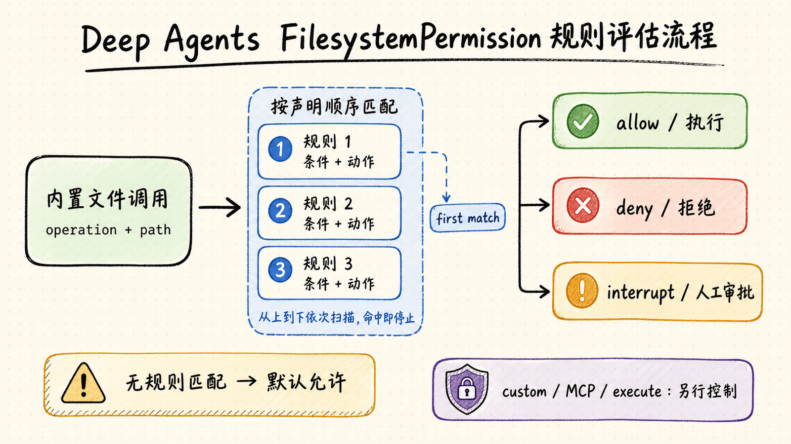
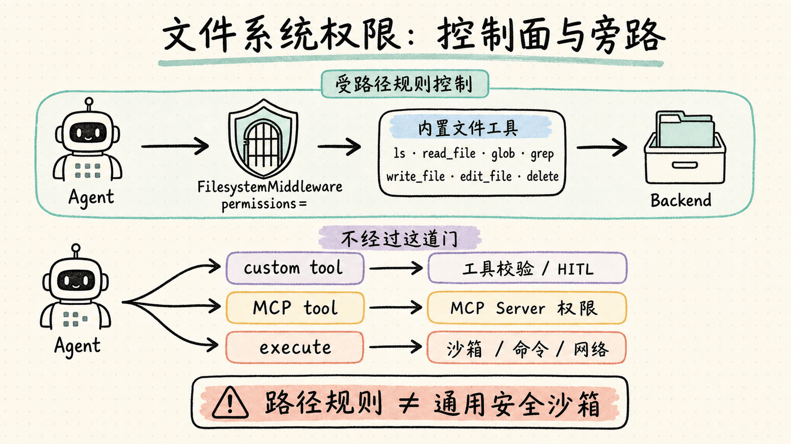

# 第 11 章：文件系统权限 — 用声明式规则控制 Agent 的读写边界

> 文件系统让 Agent 能把上下文写进文件，也把真实的副作用带进运行时。权限配置要明确三件事：可以执行的操作、可以访问的路径，以及必须由人确认的动作。本章使用 `FilesystemPermission` 把这些边界写成可审查的声明式规则。

本章基于当前 Deep Agents 官方 Permissions 文档，涉及两个最低版本：

- `allow` / `deny` 基础权限需要 `deepagents>=0.5.2`
- `interrupt` 人工审批模式需要 `deepagents>=0.6.8`

如果还不熟悉 Backend 与虚拟路径，先阅读[第 3 章：虚拟文件系统](../ch03-virtual-filesystem/)；如果需要完整的暂停与恢复流程，配合[第 9 章：Human-in-the-Loop](../ch09-human-in-the-loop/)阅读。

## 1. 权限控制的对象是什么

`create_deep_agent()` 会通过 `FilesystemMiddleware` 注入内置文件工具。传入 `permissions=` 后，中间件在调用 Backend **之前**检查每次文件操作：

| 操作组 | 覆盖的内置工具 | 典型副作用 |
|---|---|---|
| `read` | `ls`、`read_file`、`glob`、`grep` | 暴露文件名、目录结构或文件内容 |
| `write` | `write_file`、`edit_file`、`delete` | 新建、修改或删除文件 |

最小的只读配置只需拒绝所有写操作：

```python
from deepagents import FilesystemPermission, create_deep_agent


agent = create_deep_agent(
    model=model,
    backend=backend,
    permissions=[
        FilesystemPermission(
            operations=["write"],
            paths=["/**"],
            mode="deny",
        ),
    ],
)
```

这条规则不会限制读取。Agent 仍可使用 `ls`、`read_file`、`glob` 和 `grep`，但不能写入、编辑或删除文件。

### 权限不是通用安全沙箱

`FilesystemPermission` 只覆盖 Deep Agents 的**内置文件工具**。以下入口不受这组规则保护：

| 入口 | 是否受 `FilesystemPermission` 控制 | 应使用的控制方式 |
|---|---|---|
| 内置文件工具 | 是 | `permissions=` |
| 自定义 LangChain 工具 | 否 | 工具自身校验、`interrupt_on`、Middleware |
| MCP 文件工具 | 否 | MCP Server 权限、工具审批、进程隔离 |
| 沙箱或 `LocalShellBackend` 的 `execute` | 否 | 沙箱隔离、命令策略、网络与凭证控制 |
| Backend 的业务级校验 | 不足以表达 | Backend policy hook 或包装器 |

因此，“禁止 `write_file` 写入 `/secrets/`”不等于“Agent 无法通过其他工具接触 `/secrets/`”。如果 Agent 还能调用一个自定义上传工具、MCP 文件工具或 Shell，就必须分别约束这些入口。

## 2. 一条规则的三个字段

每条 `FilesystemPermission` 由三个字段组成：

| 字段 | 取值 | 作用 |
|---|---|---|
| `operations` | `"read"`、`"write"` | 指定规则拦截哪一类文件操作 |
| `paths` | Glob 路径列表 | 指定规则覆盖哪些虚拟文件路径 |
| `mode` | `"allow"`、`"deny"`、`"interrupt"` | 放行、拒绝，或暂停等待人工审批 |

路径支持 `**` 递归匹配，也支持 `{a,b}` 交替匹配。例如：

```python
FilesystemPermission(
    operations=["read", "write"],
    paths=["/workspace/**", "/shared/{docs,templates}/**"],
    mode="allow",
)
```

权限路径匹配的是 Agent 看到的 Backend 虚拟路径，不一定等于宿主机真实路径。使用 `FilesystemBackend(root_dir="/srv/project")` 时，Agent 访问的 `/src/app.py` 会由 Backend 映射到它的根目录；权限规则仍应围绕 Agent 文件空间设计。

## 3. 求值模型：首条匹配生效

权限规则按声明顺序求值，采用 **first-match-wins**：

1. 从列表第一条开始检查
2. 同时匹配 `operations` 与 `paths` 的第一条规则立即生效
3. 后续规则不再执行
4. 如果没有任何规则匹配，默认**允许**



最后一点最容易造成误配。单独写一条 `allow /workspace/**` 并不会形成工作区白名单，因为工作区外的路径没有命中规则，仍会按默认行为放行。真正的白名单需要在末尾追加全局拒绝。

### 正确的工作区白名单

```python
workspace_only = [
    FilesystemPermission(
        operations=["read", "write"],
        paths=["/workspace/**"],
        mode="allow",
    ),
    FilesystemPermission(
        operations=["read", "write"],
        paths=["/**"],
        mode="deny",
    ),
]
```

第一条放行工作区，第二条拒绝所有剩余路径。顺序不能交换，否则 `/**` 会先匹配，工作区放行规则永远不会执行。

### 先保护敏感文件，再放行目录

```python
protected_workspace = [
    FilesystemPermission(
        operations=["read", "write"],
        paths=["/workspace/.env", "/workspace/examples/**"],
        mode="deny",
    ),
    FilesystemPermission(
        operations=["read", "write"],
        paths=["/workspace/**"],
        mode="allow",
    ),
    FilesystemPermission(
        operations=["read", "write"],
        paths=["/**"],
        mode="deny",
    ),
]
```

这里必须把 `.env` 与示例目录的拒绝规则放在工作区放行规则之前。设计规则时可以遵循一个稳定顺序：

1. 最具体的敏感路径
2. 业务允许路径
3. 最宽泛的兜底规则

## 4. 四种常见策略

### 策略一：整个文件系统只读

适合审计、代码阅读、知识检索等不应产生文件副作用的 Agent：

```python
read_only = [
    FilesystemPermission(
        operations=["write"],
        paths=["/**"],
        mode="deny",
    ),
]
```

### 策略二：只能访问指定工作区

适合本地编程助手或单项目 Agent。它既防止误写工作区外的路径，也防止读取其他目录：

```python
workspace_only = [
    FilesystemPermission(
        operations=["read", "write"],
        paths=["/workspace/**"],
        mode="allow",
    ),
    FilesystemPermission(
        operations=["read", "write"],
        paths=["/**"],
        mode="deny",
    ),
]
```

### 策略三：共享知识只读，用户记忆可写

`CompositeBackend` 可以把不同虚拟路径路由到不同存储。权限规则再把组织策略设为只读：

```python
from deepagents import FilesystemPermission, create_deep_agent
from deepagents.backends import CompositeBackend, StateBackend, StoreBackend


agent = create_deep_agent(
    model=model,
    backend=CompositeBackend(
        default=StateBackend(),
        routes={
            "/memories/": StoreBackend(
                namespace=lambda rt: (rt.server_info.user.identity,),
            ),
            "/policies/": StoreBackend(
                namespace=lambda rt: (rt.context.org_id,),
            ),
        },
    ),
    permissions=[
        FilesystemPermission(
            operations=["write"],
            paths=["/policies/**"],
            mode="deny",
        ),
    ],
)
```

这里没有限制 `/memories/**`，所以用户记忆保持默认可读写；`/policies/**` 只能由应用代码或 Store API 更新。更完整的记忆作用域与路由方式见[第 8 章：长期记忆](../ch08-long-term-memory/)。

### 策略四：拒绝所有文件访问

如果 Agent 只应调用业务工具，不需要文件能力，可以同时拒绝读写：

```python
deny_all = [
    FilesystemPermission(
        operations=["read", "write"],
        paths=["/**"],
        mode="deny",
    ),
]
```

这不会从模型工具列表中移除文件工具，而是让命中的调用返回权限错误。若还希望减少无效工具选择，应同时审视 Agent 的工具与 Middleware 组合。

## 5. `interrupt`：把敏感写入交给人审批

`mode="interrupt"` 不会立即允许或拒绝操作，而是触发与工具审批相同的 Human-in-the-Loop 中断。它适合“通常可以写，但每次都要确认”的路径。

中断需要 checkpointer 保存暂停状态，并在恢复时使用相同的 `thread_id`：

```python
from deepagents import FilesystemPermission, create_deep_agent
from langgraph.checkpoint.memory import InMemorySaver
from langgraph.types import Command


agent = create_deep_agent(
    model=model,
    permissions=[
        FilesystemPermission(
            operations=["write"],
            paths=["/secrets/**"],
            mode="interrupt",
        ),
    ],
    checkpointer=InMemorySaver(),
)

config = {"configurable": {"thread_id": "permission-review-1"}}

result = agent.invoke(
    {
        "messages": [
            {
                "role": "user",
                "content": "把临时凭证写入 /secrets/token.txt",
            }
        ]
    },
    config=config,
    version="v2",
)

if result.interrupts:
    request = result.interrupts[0].value["action_requests"][0]
    print(request["name"], request["args"])

    result = agent.invoke(
        Command(resume={"decisions": [{"type": "approve"}]}),
        config=config,
        version="v2",
    )
```

审查方可以返回 `approve`、`edit` 或 `reject`。权限中断还会和 `interrupt_on=` 中的自定义工具审批合并，因此调用方可以用同一套恢复协议处理两类动作。

### 路径模式要有明确锚点

对中断规则，优先使用 `/secrets/**` 或 `/projects/*/secrets/**` 这类带固定前缀的模式。`ls`、`glob`、`grep` 以及目录 `delete` 等批量操作需要判断整个搜索子树是否可能碰到受保护路径；完全不锚定的 `/**/secrets` 会导致保守的过度中断。

### 删除目录是全有或全无

删除目录时，Deep Agents 会检查目标目录及所有后代路径的 `write` 权限。只要其中一项被拒绝，整个删除操作都会失败，不会出现“删掉一半、留下受保护文件”的部分结果。

## 6. 子 Agent：默认继承，显式配置则整体替换

子 Agent 默认继承主 Agent 的权限。只要在子 Agent spec 中提供 `permissions`，这组规则就会**完整替换**父 Agent 的规则，而不是追加或取交集。

下面的主 Agent 可以在工作区读写，审计子 Agent 只能读取工作区：

```python
from deepagents import FilesystemPermission, create_deep_agent


agent = create_deep_agent(
    model=model,
    backend=backend,
    permissions=[
        FilesystemPermission(
            operations=["read", "write"],
            paths=["/workspace/**"],
            mode="allow",
        ),
        FilesystemPermission(
            operations=["read", "write"],
            paths=["/**"],
            mode="deny",
        ),
    ],
    subagents=[
        {
            "name": "auditor",
            "description": "只读代码审计员",
            "system_prompt": "审查代码并报告问题，不要修改文件。",
            "permissions": [
                FilesystemPermission(
                    operations=["write"],
                    paths=["/**"],
                    mode="deny",
                ),
                FilesystemPermission(
                    operations=["read"],
                    paths=["/workspace/**"],
                    mode="allow",
                ),
                FilesystemPermission(
                    operations=["read"],
                    paths=["/**"],
                    mode="deny",
                ),
            ],
        }
    ],
)
```

由于是整体替换，子 Agent 的规则必须独立闭合：不要只写“额外拒绝写入”，却忘记把父 Agent 的工作区读取边界带过来。子 Agent 的其他继承规则见[第 5 章：子 Agent 与上下文隔离](../ch05-subagents/)。

## 7. CompositeBackend 与沙箱的特殊边界

### CompositeBackend：权限路径必须落在可控制的路由上

当 `CompositeBackend` 的默认 Backend 是沙箱时，权限路径必须位于已知的路由前缀下。下面只保护 `/memories/` 路由，因此是有效配置：

```python
from deepagents import FilesystemPermission, create_deep_agent
from deepagents.backends import CompositeBackend


composite = CompositeBackend(
    default=sandbox,
    routes={"/memories/": memories_backend},
)

agent = create_deep_agent(
    model=model,
    backend=composite,
    permissions=[
        FilesystemPermission(
            operations=["write"],
            paths=["/memories/**"],
            mode="deny",
        ),
    ],
)
```

如果把规则改成 `/workspace/**` 或 `/**`，它会覆盖沙箱默认路由，`create_deep_agent()` 会抛出 `NotImplementedError`。原因是沙箱提供任意命令执行，单靠文件工具的路径规则无法建立真实边界。

### `execute` 不受文件权限约束

沙箱中的 `execute` 可以通过 Shell 访问沙箱文件系统。即使内置 `write_file` 被拒绝，也不能推导出 Shell 命令无法写同一路径。

因此两类控制解决的是不同问题：

- `FilesystemPermission`：约束内置文件工具的路径访问
- 沙箱策略：隔离宿主机，限制网络、凭证、进程与命令能力

二者应组合，而不能互相替代。完整的执行边界与文件传输模型见[第 10 章：沙箱执行](../ch10-sandboxes/)。



## 8. 什么时候升级到自定义策略

声明式权限适合回答“某类操作能否访问某个路径”。如果判断条件超出这两个维度，应使用 Backend policy hook、Backend 包装器或自定义 Middleware。

### Backend policy hook 到底是什么

官方文档中的“policy hook”不是一个可以直接传给 `create_deep_agent(policy_hook=...)` 的独立参数。它是一种 **Backend 扩展模式**：在真正的存储 Backend 前加入业务校验，再决定转发调用还是返回错误。

与 `FilesystemPermission` 组合时，内置文件调用按下面的顺序经过两层控制：

```text
内置文件工具
  -> FilesystemPermission：先检查 operation 与 path
  -> GuardedBackend / PolicyWrapper：再执行动态业务策略
  -> 实际存储 Backend
```

因此两者不是替代关系：

- `FilesystemPermission` 适合稳定、可枚举、可审查的路径基线
- Backend policy hook 适合频率、内容、调用身份、租户状态或审计等动态条件
- 没有通过内置文件工具进入 Backend 的自定义工具、MCP 工具和 `execute`，仍需单独控制

### 两种实现方式

| 方式 | 适用场景 | 主要代价 |
|---|---|---|
| 继承具体 Backend | 只使用一种 Backend，并希望复用它的实现 | 策略与具体 Backend 类型绑定 |
| 包装 `BackendProtocol` | 同一策略需要复用于 State、Store、Filesystem 等不同 Backend | 必须完整转发未拦截的方法 |

官方示例使用 `GuardedBackend` 继承 `FilesystemBackend`。命中策略时，它返回带 `error` 的 `WriteResult` 或 `EditResult`；未命中时才调用父类：

```python
from deepagents.backends.filesystem import FilesystemBackend
from deepagents.backends.protocol import EditResult, WriteResult


class GuardedBackend(FilesystemBackend):
    def __init__(self, *, deny_prefixes: list[str], **kwargs):
        super().__init__(**kwargs)
        self.deny_prefixes = [
            prefix if prefix.endswith("/") else prefix + "/"
            for prefix in deny_prefixes
        ]

    def _denied(self, path: str) -> bool:
        return any(path.startswith(prefix) for prefix in self.deny_prefixes)

    def write(self, file_path: str, content: str) -> WriteResult:
        if self._denied(file_path):
            return WriteResult(error=f"Writes are not allowed under {file_path}")
        return super().write(file_path, content)

    def edit(
        self,
        file_path: str,
        old_string: str,
        new_string: str,
        replace_all: bool = False,
    ) -> EditResult:
        if self._denied(file_path):
            return EditResult(error=f"Edits are not allowed under {file_path}")
        return super().edit(file_path, old_string, new_string, replace_all)


backend = GuardedBackend(
    root_dir="/srv/agent-workspace",
    virtual_mode=True,
    deny_prefixes=["/policies"],
)
```

这个示例主要用于展示扩展点。单纯的静态路径拒绝优先写成 `FilesystemPermission`，更容易审查规则顺序；当策略需要读取内容、查询外部配额或写入业务审计记录时，再把判断放进 Backend 层。

如果所用 Backend 支持 `delete`，并且应用暴露了删除工具，包装器还要处理 `delete()` 并返回 `DeleteResult`。不要只拦截 `write()` 和 `edit()`，却留下删除旁路。

### 包装器如何复用策略

通用 `PolicyWrapper` 持有一个 `inner: BackendProtocol`：`ls()`、`read()`、`glob()`、`grep()` 等无须检查的方法直接转发；`write()`、`edit()`、`delete()` 等有副作用的方法先执行策略。这样同一个策略可以包住不同的实际 Backend。完整的转发实现见官方文档的 [Generic wrapper](https://docs.langchain.com/oss/python/deepagents/backends#add-policy-hooks) 示例。

包装器必须保持 Backend 协议的返回类型和路径语义。策略拒绝应返回相应结果对象中的 `error`，让文件工具得到可处理的结构化失败；策略放行时则原样返回内部 Backend 的结果。

| 需求 | 推荐机制 |
|---|---|
| 拒绝写入 `/policies/**` | `FilesystemPermission` |
| 写入 `/releases/**` 前人工确认 | `FilesystemPermission(mode="interrupt")` |
| 每分钟最多写入 20 次 | Backend 包装器（policy hook）/ Middleware |
| 按文件内容做敏感信息检查 | Backend 包装器 / Middleware |
| 为每次访问记录业务审计字段 | Backend 包装器（policy hook） |
| 控制自定义工具或 MCP 工具 | 工具自身策略 + `interrupt_on` |
| 控制 Shell 命令和网络 | 沙箱与执行策略 |

一个稳妥的分层方式是：

1. 用 `permissions` 表达稳定、可审查的路径基线
2. 用 `interrupt` 把少量敏感动作交给人
3. 用 policy hook 处理依赖内容、频率、身份或业务状态的动态判断
4. 在所有绕过内置文件工具的入口单独实施控制

## 9. 上线前如何验证权限策略

权限配置是安全边界，不能只验证“允许路径能成功”。至少覆盖以下测试：

| 测试 | 要证明的保证 |
|---|---|
| 允许路径的读写 | 正常业务不被误拦截 |
| 敏感路径的读取 | `read` 规则没有遗漏 |
| 敏感路径的写入、编辑、删除 | 三个工具都映射到 `write` |
| 工作区之外的随机路径 | 末尾兜底规则真实生效 |
| 规则顺序交换的回归用例 | 特定拒绝不会被宽泛允许遮蔽 |
| 包含受保护后代的目录删除 | 删除不会产生部分结果 |
| 子 Agent 同一路径访问 | 继承或替换行为符合设计 |
| `interrupt` 的批准、编辑、拒绝 | 暂停与恢复都使用同一 thread |
| Backend policy hook 的允许与拒绝分支 | 动态条件不会误拦正常请求，也不能被写入、编辑或删除旁路 |
| 自定义工具、MCP、`execute` | 每个旁路都有独立控制 |

尤其要加入一个“没有显式规则的陌生路径”测试。由于默认行为是允许，这个用例最容易暴露伪白名单。

## 10. 与前面章节如何组合

文件权限和前面章节的多项能力组合使用：

| 场景 | 组合方式 |
|---|---|
| 虚拟文件系统 | Backend 决定文件存在哪里，权限决定内置工具能访问哪里 |
| 中间件 | `FilesystemMiddleware` 在 Backend 调用前执行权限规则 |
| 子 Agent | 默认继承父规则；专用 Agent 可以整体替换为更小权限集 |
| Skills | 共享 Skill 目录可读但禁止 Agent 修改 |
| 长期记忆 | 用户记忆可写，组织策略与合规文件只读 |
| Human-in-the-Loop | 敏感写入使用 `interrupt`，复用同一审批与恢复协议 |
| 沙箱 | 权限控制文件工具，沙箱控制 Shell 与宿主隔离 |

应用应先建立一组权限基线，再按 Agent 职责、存储路由和执行入口缩小边界。不同职责的 Agent 不必共用同一份全局规则。

## 本章小结

- `FilesystemPermission` 控制 Deep Agents 内置文件工具，不覆盖自定义工具、MCP 工具或沙箱 `execute`
- `read` 覆盖 `ls`、`read_file`、`glob`、`grep`；`write` 覆盖 `write_file`、`edit_file`、`delete`
- 规则采用 first-match-wins，无匹配时默认允许；白名单必须有末尾全局拒绝
- `interrupt` 需要 `deepagents>=0.6.8` 与 checkpointer，并复用 HITL 的暂停、审查和恢复协议
- 子 Agent 默认继承权限；显式提供 `permissions` 后整体替换父规则
- CompositeBackend 使用沙箱默认路由时，只能为已知的非沙箱路由配置路径权限
- Backend policy hook 通过继承或包装 Backend 实现，不是 `create_deep_agent()` 的独立参数
- 路径规则、Backend 动态策略、工具审批与沙箱隔离分别负责不同边界，需要组合使用

## 官方参考

- [Deep Agents Permissions](https://docs.langchain.com/oss/python/deepagents/permissions)
- [Deep Agents Backends](https://docs.langchain.com/oss/python/deepagents/backends)
- [Deep Agents Backends：Add policy hooks](https://docs.langchain.com/oss/python/deepagents/backends#add-policy-hooks)
- [Deep Agents Human-in-the-Loop](https://docs.langchain.com/oss/python/deepagents/human-in-the-loop)
- [Deep Agents Subagents](https://docs.langchain.com/oss/python/deepagents/subagents)
- [Deep Agents Memory](https://docs.langchain.com/oss/python/deepagents/memory)
- [Deep Agents Sandboxes](https://docs.langchain.com/oss/python/deepagents/sandboxes)
- [FilesystemPermission API Reference](https://reference.langchain.com/python/deepagents/middleware/permissions/FilesystemPermission)
