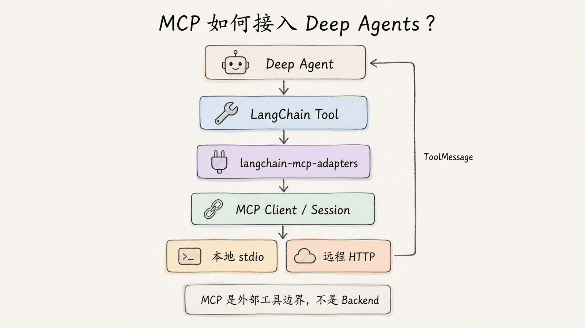
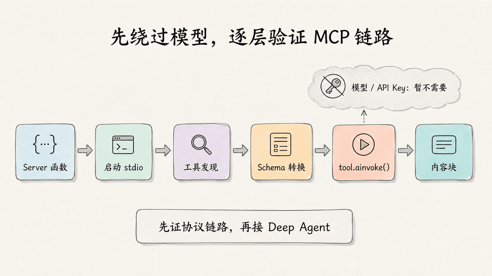
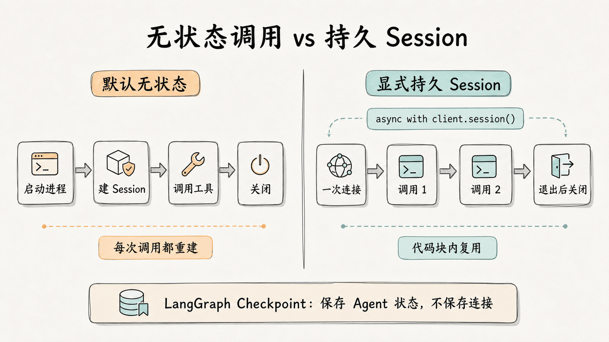
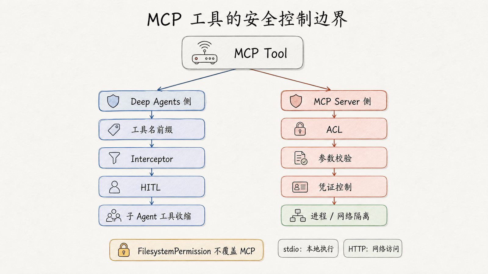

# 第 12 章：MCP — 用标准协议扩展 Deep Agents 工具生态

> 自定义工具适合接入少量、稳定的应用能力；当 Agent 需要连接越来越多的数据库、文件系统和外部服务时，逐个维护专用适配代码会迅速失控。本章使用 Model Context Protocol（MCP）建立统一边界：先运行一个本地 MCP Server，再把它暴露的工具转换成 LangChain Tool，最后交给 Deep Agent 调用。

本章完成一条可以分层验证的接入链路：

1. 创建一个提供 `add` 与 `multiply` 的本地 MCP Server
2. 不使用模型密钥，验证工具发现、Schema 转换与真实调用
3. 把 MCP 工具传给 `create_deep_agent(tools=...)`
4. 理解多 Server、HTTP、会话、错误与结构化结果
5. 为 MCP 工具补上命名、审批、子 Agent 和进程安全边界

本章原始示例写于 Deep Agents 0.6 阶段，现已把课程运行基线更新为 Python 3.11+、`deepagents>=0.7,<0.8`、`langchain-mcp-adapters>=0.3,<0.4`、`mcp>=1.28,<2`。安装时会解析当前 0.7.x 补丁版本，项目应提交 lockfile 或保存环境快照。MCP 依赖继续保留原有兼容上界，避免在学习 Deep Agents 0.7 的同时切换另一套尚未验证的 MCP API。

## 1. MCP 在 Deep Agents 中的位置

MCP 是一套开放协议，用统一方式描述 Agent 可以使用的工具与上下文。它不替代 Deep Agents，也不是一种 Backend。两者位于不同层次：

| 层次 | 本章组件 | 负责什么 |
|---|---|---|
| Agent Harness | Deep Agents | 文件系统、上下文管理、子 Agent、可选规划与工具调用循环 |
| Agent 工具接口 | LangChain Tool | 让模型看到工具名、描述、参数 Schema，并执行调用 |
| 协议适配 | `langchain-mcp-adapters` | 把 MCP 工具转换成 LangChain Tool |
| MCP Client | `MultiServerMCPClient` | 连接一个或多个 Server，管理发现与调用会话 |
| MCP Server | 本地进程或远程服务 | 真正执行数据库、API、文件或业务操作 |

程序化接入的主路径非常直接：

```text
用户请求
  -> Deep Agent 决定调用工具
  -> LangChain Tool 校验参数
  -> MCP Client 建立 Session
  -> MCP Server 执行业务逻辑
  -> 结果转换成 ToolMessage
  -> Deep Agent 继续推理并回答
```



`create_deep_agent()` 不直接接收 MCP 配置，也不负责 MCP Session 的生命周期。应用先通过客户端加载工具，再把得到的 LangChain Tool 列表传入 `tools=`。下面是**示意片段**；它省略了 `MultiServerMCPClient` 与 `create_deep_agent` 的导入，以及 `client`、`model` 的定义，并且必须放在异步函数内执行：

```python
tools = await client.get_tools()
agent = create_deep_agent(model=model, tools=tools)
```

这些工具会加入 Deep Agents 的工具集合，与文件系统和子 Agent 等 Harness 能力一起提供给模型。任务规划在 v0.7 中需要显式启用 `TodoListMiddleware`。MCP Server 不会因此自动获得 Deep Agents 的状态、Store 或 Backend；它仍是边界外的独立进程或服务。

### Tools、Resources 与 Prompts

MCP 不只有工具。先区分三个核心概念，才能避免把所有能力都塞进 `tools=`：

| MCP 能力 | LangChain 转换结果 | 是否直接传给 Agent | 典型用途 |
|---|---|---|---|
| Tools | `BaseTool` / `StructuredTool` | 是 | 查询数据库、调用 API、执行业务操作 |
| Resources | `Blob` | 否 | 读取文件、记录或二进制资源，由应用决定如何注入上下文 |
| Prompts | 消息列表 | 否 | 获取可复用提示模板，由应用决定放入哪段对话 |

本章实战围绕 Tools 展开。Resources 和 Prompts 会在后文展示最小读取方式，但它们不会因为调用 `get_tools()` 就自动出现在模型上下文中。

## 2. 准备可复现环境

新建一个练习目录，并安装稳定依赖：

```bash
mkdir deepagents-mcp-demo
cd deepagents-mcp-demo
uv init --bare --python 3.11
uv add --upgrade "deepagents>=0.7,<0.8" "langchain-mcp-adapters>=0.3,<0.4" "mcp>=1.28,<2" langchain-openai
```

如果使用 `pip`，等价命令是：

```bash
python -m venv .venv
source .venv/bin/activate
python -m pip install --upgrade "deepagents>=0.7,<0.8" "langchain-mcp-adapters>=0.3,<0.4" "mcp>=1.28,<2" langchain-openai
```

本章最终得到三个文件：

```text
deepagents-mcp-demo/
├── math_server.py    # MCP Server
├── check_mcp.py      # 无模型密钥的协议冒烟测试
└── agent.py          # Deep Agent 集成
```

这里直接使用官方 `mcp` Python SDK 内置的 `FastMCP`。它足以完成教学 Server，不需要再引入另一个 Server 框架。

## 3. 创建本地 MCP Server

把下面的完整代码保存为 `math_server.py`：

```python
from mcp.server.fastmcp import FastMCP


mcp = FastMCP("Chapter 12 Math")


@mcp.tool()
def add(a: int, b: int) -> int:
    """Add two integers exactly."""
    return a + b


@mcp.tool()
def multiply(a: int, b: int) -> int:
    """Multiply two integers exactly."""
    return a * b


if __name__ == "__main__":
    mcp.run(transport="stdio")
```

`@mcp.tool()` 把普通 Python 函数转换成 MCP Tool。三个信息会直接影响模型如何使用它：

| Python 定义 | MCP Tool 字段 | LangChain Tool 中的作用 |
|---|---|---|
| 函数名 `add` | `name` | 模型调用的工具名 |
| docstring | `description` | 告诉模型何时调用 |
| 类型标注 `a: int` | `inputSchema` | 校验参数并生成 JSON Schema |

Server 使用 `stdio` 传输后，不需要提前监听端口。Client 会把 `math_server.py` 启动为子进程，通过标准输入和标准输出交换 MCP 消息。

> `stdio` Server 不要用 `print()` 向标准输出写调试日志，否则日志可能混入协议数据。需要日志时写入标准错误，或使用 MCP 的日志通知。

## 4. 不使用模型，先验证 MCP 链路

Agent 不调用工具，可能是模型选择、提示词、工具描述或协议连接中的任一环节出了问题。最稳妥的排错顺序，是先绕过模型直接调用转换后的工具。

把下面的完整代码保存为 `check_mcp.py`：

```python
import asyncio
import sys
from pathlib import Path

from langchain_mcp_adapters.client import MultiServerMCPClient


SERVER = Path(__file__).with_name("math_server.py").resolve()


def schema_as_dict(tool) -> dict:
    schema = tool.args_schema
    if isinstance(schema, dict):
        return schema
    return schema.model_json_schema()


def first_text(result: list[dict]) -> str:
    return next(block["text"] for block in result if block["type"] == "text")


async def main() -> None:
    client = MultiServerMCPClient(
        {
            "course_math": {
                "transport": "stdio",
                "command": sys.executable,
                "args": [str(SERVER)],
            }
        },
        tool_name_prefix=True,
    )

    tools = await client.get_tools()
    print("tools:", [tool.name for tool in tools])

    add_tool = next(tool for tool in tools if tool.name == "course_math_add")
    schema = schema_as_dict(add_tool)
    print("description:", add_tool.description)
    print("required:", schema["required"])

    result = await add_tool.ainvoke({"a": 37, "b": 58})
    print("37 + 58 =", first_text(result))


if __name__ == "__main__":
    asyncio.run(main())
```

运行：

```bash
uv run python check_mcp.py
```

在本章固定版本下，关键输出如下：

```text
tools: ['course_math_add', 'course_math_multiply']
description: Add two integers exactly.
required: ['a', 'b']
37 + 58 = 95
```

这个检查点没有使用模型或外部 API，却已经验证了六件事：

1. Python 依赖可以导入
2. Client 能启动 `stdio` 子进程
3. MCP 初始化与工具发现成功
4. 工具名、描述和参数 Schema 完成转换
5. LangChain Tool 可以发起真实 MCP 调用
6. Server 的返回值可以转换成 LangChain 内容块



### 为什么结果不是裸整数

`add()` 在 Server 内返回整数 `95`，但适配器的 `ainvoke()` 返回 LangChain 标准内容块列表，而不是裸整数：

```python
[{"type": "text", "text": "95", "id": "..."}]
```

内容块可以同时承载文本、图片和文件。示例用 `first_text()` 提取文本，因此不会依赖运行时生成的 `id`。

### 为什么必须使用异步调用

当前适配器把 MCP Tool 转换成只有 `coroutine`、没有同步 `func` 的 `StructuredTool`。直接执行下面的同步调用会失败：

```python
add_tool.invoke({"a": 37, "b": 58})
```

错误核心是：

```text
NotImplementedError: StructuredTool does not support sync invocation.
```

因此，MCP 接入应全程使用异步路径：

- `tools = await client.get_tools()`
- `await tool.ainvoke(...)`
- `await agent.ainvoke(...)`

`create_deep_agent()` 本身仍是同步的图构造函数；需要异步的是工具发现和实际运行。

## 5. 把 MCP 工具交给 Deep Agent

完成无密钥验证后，再加入模型。模型配置沿用[第 2 章：快速上手](../ch02-quickstart/)的硅基流动接入方式。

先设置两个环境变量。下面的值都是占位符，请替换成自己的真实配置，不要把密钥提交到 Git：

```bash
export SILICONFLOW_API_KEY="<your-siliconflow-api-key>"
export MODEL_NAME="<current-tool-calling-model-id>"
```

把下面的完整代码保存为 `agent.py`：

```python
import asyncio
import os
import sys
from pathlib import Path

from deepagents import create_deep_agent
from langchain_mcp_adapters.client import MultiServerMCPClient
from langchain_openai import ChatOpenAI


SERVER = Path(__file__).with_name("math_server.py").resolve()


async def main() -> None:
    client = MultiServerMCPClient(
        {
            "course_math": {
                "transport": "stdio",
                "command": sys.executable,
                "args": [str(SERVER)],
            }
        },
        tool_name_prefix=True,
    )
    tools = await client.get_tools()

    model = ChatOpenAI(
        model=os.environ["MODEL_NAME"],
        api_key=os.environ["SILICONFLOW_API_KEY"],
        base_url="https://api.siliconflow.cn/v1",
    )
    agent = create_deep_agent(
        model=model,
        tools=tools,
        system_prompt=(
            "你是一个严谨的计算助手。数学运算必须使用 MCP 工具完成，"
            "不要直接心算。"
        ),
    )

    result = await agent.ainvoke(
        {
            "messages": [
                {
                    "role": "user",
                    "content": "先计算 37 + 58，再把结果乘以 12。",
                }
            ]
        }
    )
    print(result["messages"][-1].content)


if __name__ == "__main__":
    asyncio.run(main())
```

运行：

```bash
uv run python agent.py
```

一次合理的工具序列是：

```text
course_math_add(a=37, b=58) -> 95
course_math_multiply(a=95, b=12) -> 1140
```

最终自然语言措辞由模型决定，不应把某一段完整回答当作固定输出。真正需要检查的是 Trace 或消息历史中是否出现两个 MCP 工具调用，以及第二次调用是否使用第一次结果。

> 本章编写时已真实验证 Server 启动、工具发现、Schema 转换和直接调用。上面的模型调用需要读者自己的模型凭证，本次未代替读者调用付费或外部模型。

## 6. 从一个 Server 扩展到多个 Server

`MultiServerMCPClient` 的连接字典可以同时声明本地与远程 Server。`get_tools()` 默认并发加载所有连接的工具，也可以用 `server_name=` 只加载一个 Server。

### 两种主流传输

| 传输 | Client 配置 | 生命周期 | 适用场景 |
|---|---|---|---|
| `stdio` | `command`、`args`、可选 `env` | Client 启动本地子进程 | 本地开发、可信命令、桌面应用 |
| `http` | `url`、可选 `headers` / `auth` | 连接已运行的 Streamable HTTP 服务 | 远程服务、团队共享、生产部署 |

下面是多 Server 的**示意片段**。它只展示连接配置，省略了 `MultiServerMCPClient` 的导入、前文已经定义的 `sys` 与 `SERVER`、`async def main()` 包装和后续 Agent 创建：

```python
client = MultiServerMCPClient(
    {
        "course_math": {
            "transport": "stdio",
            "command": sys.executable,
            "args": [str(SERVER)],
        },
        "langchain_docs": {
            "transport": "http",
            "url": "https://docs.langchain.com/mcp",
        },
    },
    tool_name_prefix=True,
)

all_tools = await client.get_tools()
math_tools = await client.get_tools(server_name="course_math")
```

对于新项目，远程连接优先使用 Streamable HTTP，也就是配置中的 `transport: "http"`。旧式 `sse` 已被 MCP 规范弃用；适配器虽然仍实现 WebSocket，但它不是当前推荐的 MCP 传输，新项目不应以它为主路径。

### HTTP Header 与认证

静态 Bearer Token 可以放在连接的 `headers` 中。下面是**示意片段**；`MCP_TOKEN` 是应用环境变量，`https://mcp.example.com/mcp` 代表实际服务地址：

```python
import os

from langchain_mcp_adapters.client import MultiServerMCPClient


client = MultiServerMCPClient(
    {
        "orders": {
            "transport": "http",
            "url": "https://mcp.example.com/mcp",
            "headers": {
                "Authorization": f"Bearer {os.environ['MCP_TOKEN']}",
            },
        }
    },
    tool_name_prefix=True,
)
```

复杂 OAuth 流程通过 MCP SDK 兼容的 `httpx.Auth` 实现。不要把 Token 设计成模型可以填写的工具参数；凭证应由应用配置或 Client 侧 Interceptor 注入。

### 工具命名与冲突

适配器默认保留 Server 原始工具名，而且不会自动拒绝或去重冲突。两个 Server 都提供 `search`，或者 MCP Server 暴露了与 Deep Agents 内置工具相同的名字，都可能让模型和审批策略难以判断目标。

启用 `tool_name_prefix=True` 后，工具名变成：

```text
<server_name>_<tool_name>
```

例如 `course_math` Server 的 `add` 会变成 `course_math_add`。本章从第一个示例就启用前缀，是为了让新增 Server 时不必重命名已有审批规则。

## 7. 无状态调用与持久会话

`MultiServerMCPClient` 默认是无状态的。`get_tools()` 使用临时 Session 完成发现；之后每次工具调用都会重新建立一个 Session，执行完再清理。

对于 `stdio`，默认流程意味着每次工具调用通常都会：

```text
启动子进程 -> 初始化 MCP Session -> 调用工具 -> 关闭 Session -> 结束子进程
```

这种模式隔离清晰，适合查询类工具。但如果 Server 把登录状态、游标或事务保存在进程内存中，下一次调用不会自动继承这些状态。

### 显式保持一个 Session

需要在多次调用之间保留 Server 进程与 Session 时，使用 `client.session()`。下面是**示意片段**；`client` 沿用前文的 `course_math` 连接，`model` 与 `create_deep_agent` 的定义或导入被省略，代码必须在异步函数内执行：

```python
from langchain_mcp_adapters.tools import load_mcp_tools


async with client.session("course_math") as session:
    tools = await load_mcp_tools(
        session,
        callbacks=client.callbacks,
        tool_interceptors=client.tool_interceptors,
        server_name="course_math",
        tool_name_prefix=client.tool_name_prefix,
        handle_tool_errors=client.handle_tool_errors,
    )
    agent = create_deep_agent(model=model, tools=tools)
    result = await agent.ainvoke(
        {"messages": [{"role": "user", "content": "计算 20 + 22"}]}
    )
```

Agent 的所有运行都必须在 `async with` 代码块内完成。退出后 Session 已关闭，基于它创建的工具不能继续执行。

注意三个容易忽略的细节：

1. `MultiServerMCPClient` 自身不是异步上下文管理器，不能写成 `async with MultiServerMCPClient(...)`。
2. 直接调用 `load_mcp_tools(session)` 不会自动继承 Client 的回调、Interceptor、工具名前缀和错误策略；需要像示例一样显式传入。
3. 已打开的持久 Session 不会因为 Interceptor 修改 `request.headers` 而重新认证。需要按用户动态设置 Header 时，应先准备对应连接配置，再新建 Session；动态 Header 注入更适合默认的 connection-backed 无状态调用。

### Session 与 LangGraph Checkpoint 是两套生命周期

LangGraph Checkpoint 保存的是 Agent 状态，不会序列化一个正在运行的 MCP 子进程或网络连接。因此，长时间暂停、进程重启和 HITL 恢复不能依赖 Session 内存仍然存在。

生产系统应把重要状态持久化在 Server 侧数据库中，并让写操作尽量幂等。Session 用来复用连接或短期上下文，不应成为 Agent 持久性的唯一来源。



## 8. Tools 之外：Resources、Prompts 与结构化结果

### 主动读取 Resources

下面是**示意片段**；`client` 需要包含名为 `knowledge` 的 MCP 连接，代码必须在异步函数内执行：

```python
blobs = await client.get_resources(
    "knowledge",
    uris=["file:///handbook/returns.md"],
)

for blob in blobs:
    print(blob.metadata["uri"])
    print(blob.as_string())
```

Resources 被转换成 LangChain `Blob`。应用可以把文本写入 Deep Agents 虚拟文件系统、放进提示词，或交给检索流程；Client 不会替应用自动选择。

### 主动读取 Prompts

下面是**示意片段**；`support` Server 需要提供名为 `triage` 的 Prompt，代码必须在异步函数内执行：

```python
messages = await client.get_prompt(
    "support",
    "triage",
    arguments={"severity": "high"},
)
```

返回值是消息列表，而不是一个自动安装到 Agent 的系统提示词。应用仍要决定这些消息是初始化输入、少样本示例，还是一次独立工作流的内容。

当前 0.3.x 适配器还有两个范围限制：Prompt 转换只接受文本内容，非文本 Prompt Message 会抛出 `ValueError`；`get_resources(..., uris=None)` 只枚举静态 Resources，不会自动展开需要参数的 Resource Templates。读取动态 Resource 时，应像前例一样提供已经填好参数的具体 URI。

### 结构化结果不会自动暴露给模型

MCP Tool 可以同时返回人类可读文本与 `structuredContent`。适配器把结构化部分放在 `ToolMessage.artifact["structured_content"]` 中，方便应用代码读取；它默认不会自动追加到模型看到的文本内容。

下面是**示意片段**；`result` 是一次 Agent 调用的返回状态：

```python
from langchain.messages import ToolMessage


for message in result["messages"]:
    artifact = message.artifact if isinstance(message, ToolMessage) else None
    if isinstance(artifact, dict):
        data = artifact.get("structured_content")
        if data is not None:
            print(data)
```

如果模型也需要看到结构化字段，可以在 Client 侧 Interceptor 中有选择地转换。不要无条件把大型 JSON 复制到对话历史，否则会重新制造上下文膨胀问题。

## 9. 错误语义与 Interceptor

从 `langchain-mcp-adapters>=0.3.0` 开始，MCP Server 返回 `CallToolResult(isError=True)` 时，适配器默认把它转换成 `status="error"` 的 `ToolMessage`。Agent 可以阅读错误，再修正参数或换用其他工具，而不必立即终止整次运行。

这套错误语义不要套用到文件搜索的完整性判断。v0.7 的 `grep`、`glob` 可以成功返回部分结果，并用 `truncated=True` 标记；`ToolMessage` 没有报错，只能证明调用成功，不能证明结果完整。

这只覆盖 Server 明确返回的工具执行错误：

| 失败类型 | 默认行为 |
|---|---|
| `CallToolResult(isError=True)` | 返回失败的 `ToolMessage` 给模型 |
| 传输失败 | 抛出异常 |
| Session 初始化失败 | 抛出异常 |
| 内容转换失败 | 抛出异常 |

如果应用希望工具执行错误也进入异常处理路径，可以关闭默认转换。下面是**示意片段**；`connections` 代表前文同结构的连接字典，`MultiServerMCPClient` 沿用前文导入：

```python
client = MultiServerMCPClient(
    connections,
    handle_tool_errors=False,
)
```

关闭后，Server 的 `isError=True` 结果会以 `ToolException` 形式抛出。

### Client Interceptor 不是 Agent Middleware

MCP Tool Interceptor 包装的是“调用 MCP Tool”这一步；Deep Agents Middleware 包装的是更广的 Agent 模型与工具循环。Interceptor 适合：

- 从可信运行时注入用户或租户信息
- 动态增加 HTTP Header
- 记录审计事件
- 在调用 Server 前拒绝请求
- 转换 Server 返回结果

下面是**示意片段**。它假设 Agent 定义了包含 `authenticated` 字段的状态，`connections` 是前文同结构的连接字典；`request.runtime` 由 LangChain 工具运行时提供：

```python
from langchain.messages import ToolMessage
from langchain_mcp_adapters.client import MultiServerMCPClient
from langchain_mcp_adapters.interceptors import MCPToolCallRequest


async def require_authentication(
    request: MCPToolCallRequest,
    handler,
):
    is_authenticated = request.runtime.state.get("authenticated", False)
    if (
        request.server_name == "orders"
        and request.name == "cancel"
        and not is_authenticated
    ):
        return ToolMessage(
            content="Authentication required.",
            tool_call_id=request.runtime.tool_call_id,
            status="error",
        )
    return await handler(request)


client = MultiServerMCPClient(
    connections,
    tool_interceptors=[require_authentication],
)
```

Interceptor 中的 `request.name` 是 Server 暴露的原始 MCP 工具名，Server 身份通过 `request.server_name` 判断；这与 `interrupt_on` 使用最终、带前缀的 LangChain Tool 名不同。

Server 运行在独立进程或服务中，不能直接读取 LangGraph 的 State、Store 或运行时 Context。Interceptor 是 Client 侧桥梁，但真正的授权与参数校验仍应在 Server 侧执行，不能只依赖 Agent 进程中的前置检查。

## 10. 与 Deep Agents 安全机制组合

MCP 把工具接进来，不会自动建立权限边界。工具描述、annotations 和系统提示词都只能影响模型行为，不能代替强制控制。

### 文件权限不覆盖 MCP 工具

第 11 章的 `FilesystemPermission` 只控制 Deep Agents 内置文件工具。即使应用禁止内置 `read_file` 访问敏感路径，一个 MCP 文件 Server 仍可能用自己的进程权限读取同一路径。

因此，[第 11 章：文件系统权限](../ch11-filesystem-permissions/)与本章负责不同边界：

| 入口 | 应使用的控制 |
|---|---|
| Deep Agents 内置文件工具 | `FilesystemPermission` |
| MCP Tool | Server 端 ACL、参数校验、进程隔离、Interceptor、HITL |
| 沙箱 `execute` | 沙箱文件、命令与网络策略 |



### 对副作用工具配置 HITL

MCP 工具转换成标准 LangChain Tool 后，可以使用 Deep Agents 的 `interrupt_on`。配置键必须使用模型最终看到的工具名；启用前缀后，应该写 `billing_charge_card`，而不是原始的 `charge_card`。

下面是**示意片段**。`model`、`billing_tools` 与恢复流程沿用应用已有定义，完整的暂停与恢复方式见[第 9 章：Human-in-the-Loop](../ch09-human-in-the-loop/)：

```python
from deepagents import create_deep_agent
from langgraph.checkpoint.memory import InMemorySaver


agent = create_deep_agent(
    model=model,
    tools=billing_tools,
    interrupt_on={
        "billing_charge_card": {
            "allowed_decisions": ["approve", "reject"],
        }
    },
    checkpointer=InMemorySaver(),
)
```

审批发生在适配器真正调用 MCP Server 之前。MCP Tool annotation 中的 `destructiveHint` 等字段会保留在 Tool metadata 中，但不会自动生成 Deep Agents 审批策略。

### 缩小子 Agent 的额外工具集

默认 general-purpose 子 Agent 会继承父 Agent 的额外工具，自定义声明式子 Agent 在省略 `tools` 时也会继承。显式提供 `tools` 后，会整体替换这组继承的额外工具，而不是追加；但 Deep Agents Harness 安装的文件工具，以及 Backend 支持时可能出现的 `execute`，不会因此自动移除。

规划能力另有一条 v0.7 规则：主 Agent 显式传入的 `TodoListMiddleware` 会交给默认 general-purpose 子 Agent；声明式子 Agent 有独立 Middleware 栈。如果它也需要 `write_todos`，应在自己的 `middleware` 字段中启用，不能从工具继承规则推断它会自动获得 Todo。

下面是**示意片段**。`read_only_mcp_tools` 是应用筛选后的 LangChain Tool 列表；`model` 与 `all_mcp_tools` 沿用父 Agent 已有定义。示例同时拒绝子 Agent 使用内置文件工具写入：

```python
from deepagents import FilesystemPermission, create_deep_agent


agent = create_deep_agent(
    model=model,
    tools=all_mcp_tools,
    subagents=[
        {
            "name": "catalog-reader",
            "description": "只使用只读 MCP 工具查询商品目录",
            "system_prompt": "只使用目录查询 MCP 工具回答商品问题。",
            "tools": read_only_mcp_tools,
            "permissions": [
                FilesystemPermission(
                    operations=["write"],
                    paths=["/**"],
                    mode="deny",
                )
            ],
        }
    ],
)
```

这里的 `tools` 只收缩额外 MCP 工具，`permissions` 只拒绝内置文件工具写入；如果 Backend 暴露 `execute`，还必须在沙箱层禁用或隔离命令与网络能力。

声明式 `SubAgent` 省略 `interrupt_on` 时会继承父 Agent 的审批映射；一旦提供自己的映射，就会整体替换父映射，而不是逐项合并，因此必须重复仍需保留的规则。预编译的 `CompiledSubAgent` 和远程 `AsyncSubAgent` 都不会继承父 Agent 的 `interrupt_on`，审批应分别配置在其内部图或远程服务中。

### `stdio` 是本地代码执行配置

`stdio` 连接中的 `command`、`args` 和 `env` 不只是普通数据。Client 会用当前应用用户的权限执行该命令，程序化 SDK 不会弹出“是否信任此项目”的确认框。

上线前至少做到：

1. 只运行经过审核的 Server 包和命令
2. 固定依赖版本与来源，避免每次启动下载未知最新版
3. 使用绝对路径或受控可执行文件，不接受模型生成的命令
4. 最小化传给子进程的环境变量，不继承无关密钥
5. 在 Server 内再次校验路径、租户与资源权限
6. Web 服务场景优先使用隔离的远程 MCP 服务，而不是随请求启动宿主进程

远程 HTTP Server 同样不是天然安全的：应使用 TLS，限制允许连接的主机，防止访问 localhost 或云元数据地址，并审计 Header 中传递的秘密。

## 11. 排错清单

| 现象 | 常见原因 | 处理方式 |
|---|---|---|
| `StructuredTool does not support sync invocation` | 使用了 `invoke()` | 改用 `ainvoke()`，Agent 也走异步路径 |
| 找不到 `math_server.py` | `stdio` 子进程工作目录不同 | 用 `Path(__file__).with_name("math_server.py").resolve()` 生成 Server 的绝对路径 |
| Server 一启动就协议解析失败 | 向标准输出打印了调试日志 | 把日志写到标准错误或使用 MCP 日志通知 |
| 工具名不是 `course_math_add` | 没有开启前缀，或持久 Session 加载时漏传选项 | 设置 `tool_name_prefix=True`；`load_mcp_tools()` 时显式重复参数 |
| 每次调用后 Server 状态丢失 | 默认每次调用创建新 Session | 使用 `client.session()`，或把状态持久化到 Server 数据库 |
| 模型不调用 MCP Tool | 模型不支持稳定工具调用，或描述不清 | 先直接 `ainvoke()` 验证工具，再检查模型、docstring 与系统提示词 |
| MCP 工具报错但没有抛异常 | 适配器 0.3 默认把 `isError=True` 返回给模型 | 检查 `ToolMessage.status`，或设置 `handle_tool_errors=False` |
| HTTP 返回 401 / 403 | Header、Token、OAuth 或 Server ACL 错误 | 先用独立 Client 验证认证，不让模型填写凭证 |
| HITL 没有拦截工具 | `interrupt_on` 使用了原始名 | 改为带 Server 前缀的最终 LangChain Tool 名 |
| 文件权限规则没有拦截 MCP | `FilesystemPermission` 不覆盖 MCP Tool | 在 MCP Server、进程边界与 HITL 分别实施控制 |

排错时始终按层次缩小范围：

```text
Server 函数
  -> MCP 工具发现
  -> LangChain Tool 直接调用
  -> Deep Agent 工具调用
  -> 多 Server、认证、HITL 与子 Agent
```

不要一开始就把模型、网络认证、持久会话和多 Agent 同时接入。无密钥冒烟测试越早通过，后续问题越容易定位。

## 本章小结

- Deep Agents 通过 `tools=` 接收 MCP 工具，不直接管理 MCP Client 或 Session
- `MultiServerMCPClient.get_tools()` 把 MCP Tool 转换成标准 LangChain Tool
- MCP 工具是异步工具，应使用 `get_tools()`、`tool.ainvoke()` 与 `agent.ainvoke()`
- `tool_name_prefix=True` 使用 `<server>_<tool>` 命名，可降低多 Server 与内置工具的冲突风险
- 默认模式为每次工具调用创建新 Session；有状态 Server 需要显式 `client.session()`
- Resources 转换为 `Blob`，Prompts 转换为消息列表，都不会自动进入 Agent 上下文
- 适配器 0.3 默认把 `isError=True` 转成失败的 `ToolMessage`，传输与 Session 错误仍会抛出
- `FilesystemPermission` 不覆盖 MCP Tool；Server ACL、进程隔离、HITL 与子 Agent 工具收缩需要组合使用
- `stdio` 会以应用用户权限启动本地命令，连接配置必须像代码执行入口一样审查

## 官方参考

- [Deep Agents Tools：MCP tools](https://docs.langchain.com/oss/python/deepagents/tools#mcp-tools)
- [LangChain Model Context Protocol（MCP）](https://docs.langchain.com/oss/python/langchain/mcp)
- [Deep Agents Human-in-the-Loop](https://docs.langchain.com/oss/python/deepagents/human-in-the-loop)
- [Deep Agents Permissions](https://docs.langchain.com/oss/python/deepagents/permissions)
- [Deep Agents Subagents](https://docs.langchain.com/oss/python/deepagents/subagents)
- [`langchain-mcp-adapters`](https://github.com/langchain-ai/langchain-mcp-adapters)
- [MCP Python SDK](https://github.com/modelcontextprotocol/python-sdk)
- [Model Context Protocol](https://modelcontextprotocol.io/introduction)
- [MCP Security Best Practices](https://modelcontextprotocol.io/docs/tutorials/security/security_best_practices)
