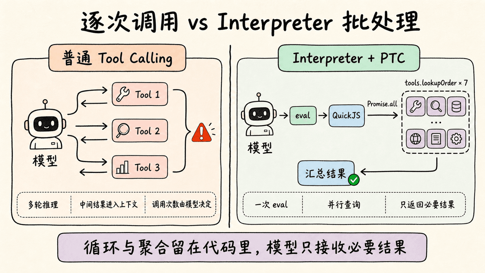
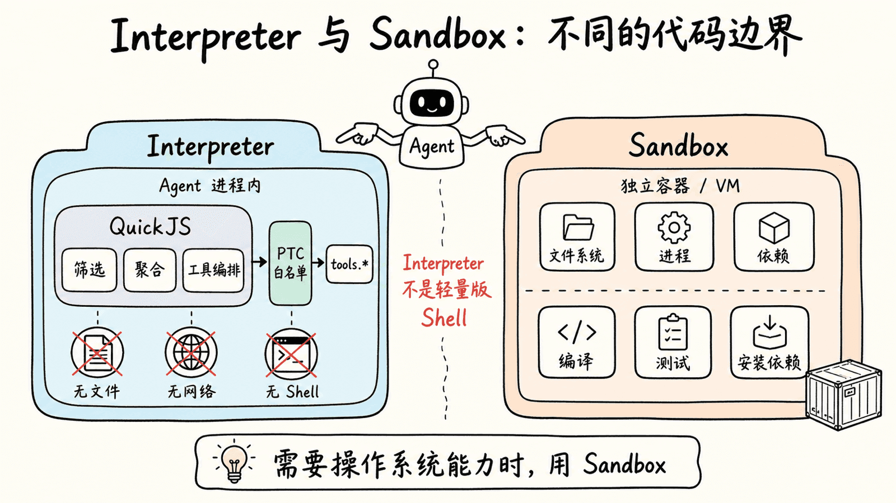
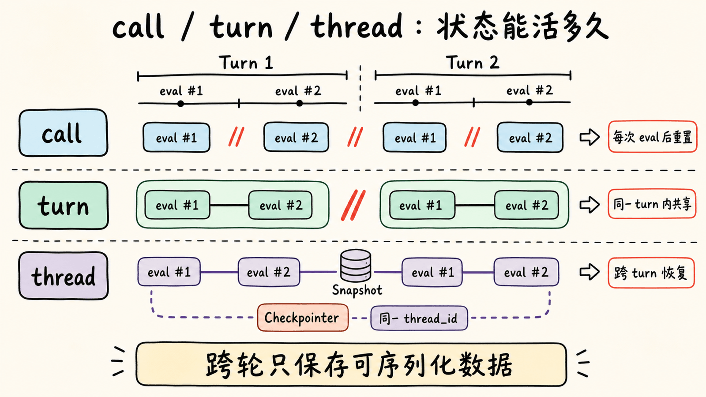
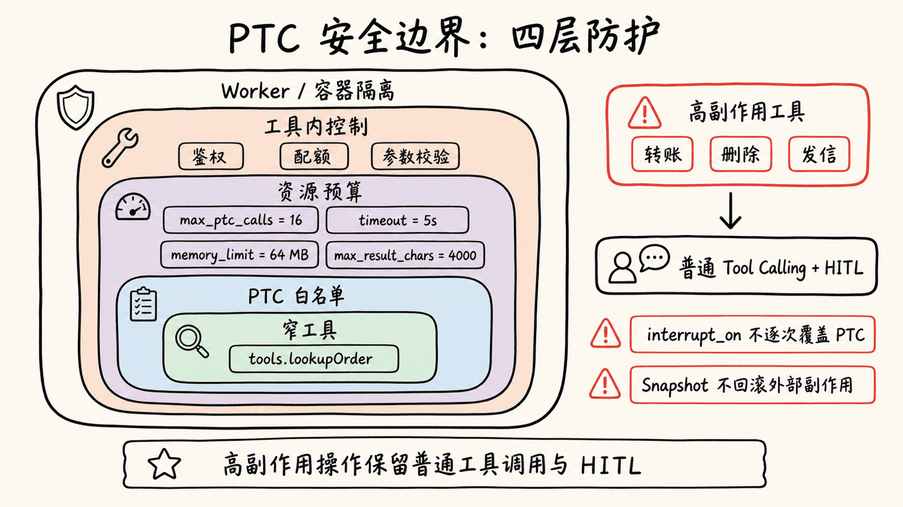

# 第 15 章：Interpreters — 让 Agent 用代码编排工具与数据

> 订单审核 Agent 收到 80 个订单号。它先调用一次查询工具，等结果回来，再调用下一次。几十条工具结果陆续进入上下文，模型还没完成审核，已经开始漏项。查询工具没有问题，真正不合适的是编排方式：循环、筛选和聚合都交给了模型逐轮决定。

普通 Tool Calling 适合少量、彼此独立的调用。任务一旦需要根据结果继续分支、重试或批量处理，模型就要为每一步重新推理，所有中间结果也会返回上下文。Interpreters（解释器）把这部分工作移进代码：模型决定要完成什么，再用 JavaScript 组织具体步骤，只把整理后的结果带回对话。

你会给 Deep Agent 加入 `CodeInterpreterMiddleware`，先运行一段纯内存 JavaScript，再通过 Programmatic Tool Calling（PTC，程序化工具调用）批量读取订单。完成实验后，你应该能判断什么时候使用普通工具调用、Interpreter 或 Sandbox，并能为 PTC 配置最小权限边界。

Interpreters 目前是 Beta API。示例要求 Python 3.11+ 和 `langchain-quickjs>=0.2.0`，接口与生命周期仍可能变化。本章在 Python 3.11.14、`deepagents==0.7.8` 和 `langchain-quickjs==0.3.5` 中核对；只讲解释器和 PTC，动态调度子 Agent 留到下一章。

## 1. 为什么需要 Interpreter

先看订单审核任务的自然写法。Agent 需要读取每个订单，按金额和退款次数筛选风险项，再生成摘要。

普通工具调用大致经历下面的循环：

```text
模型决定查询 A-100 -> 工具返回 A-100 -> 结果进入模型上下文
模型决定查询 A-101 -> 工具返回 A-101 -> 结果进入模型上下文
模型决定查询 A-102 -> 工具返回 A-102 -> 结果进入模型上下文
……
模型整理全部结果 -> 返回风险订单
```

模型可以在同一轮发出一批工具调用，但这批调用在生成完成时已经固定。它不能在同一批中读取第一个结果，再据此决定第二个调用；循环、条件分支和重试通常都需要新的模型轮次。

数据量很小时，这种方式最直接。数据量变大后，问题会逐渐暴露：

1. 模型决定调用次数，难以保证每个输入都被处理。
2. 每个中间结果都进入上下文，占用 token 并干扰后续判断。
3. 排序、分组、去重等确定性工作仍由模型反复完成。
4. 工具调用被拆到更多模型轮次中，延迟和调用成本随之增加。

Interpreter 提供另一条路径：模型生成一段 JavaScript，由 QuickJS 在 Agent 循环内执行。循环、分支和数据转换留在代码中，模型只接收最后的结果。

| 任务形状 | 优先选择 | 原因 |
|---|---|---|
| 一两个简单外部调用 | 普通 Tool Calling | 路径短，额外编排没有收益 |
| 纯内存排序、分组、解析或校验 | Interpreter | JavaScript 可以确定性处理数据 |
| 大量外部工具调用，需要循环或并行 | Interpreter + PTC | 代码控制调用和聚合，只返回必要结果 |
| Shell、安装依赖、运行测试或操作完整文件系统 | Sandbox | 需要独立执行环境和操作系统能力 |
| 大量独立任务需要不同 Agent 角色 | Dynamic Subagents | 每个角色都要运行完整的子 Agent 推理循环 |

Interpreter 不是轻量版 Shell，也不是本地沙箱。它是 Agent 循环里的内存代码运行时。



## 2. 准备环境并运行第一段 JavaScript

在已有 Python 项目中安装 Deep Agents、QuickJS 中间件和模型集成：

```bash
uv add "deepagents[quickjs]" langchain-openai
```

如果项目已经声明了其中某个依赖，`uv` 会保留满足条件的现有版本。

检查 Python、Deep Agents 和 QuickJS 中间件是否可以导入：

```bash
uv run python -c "import sys, deepagents, langchain_quickjs; print(sys.version_info[:2]); print(langchain_quickjs.__name__)"
```

```text title="关键输出"
(3, 14)
langchain_quickjs
```

这里展示的是本章实际验证时的版本。你的 Python 次版本可以不同，但不能低于 `(3, 11)`；第二行应为相同的模块名。

后文沿用课程的 OpenAI 兼容环境变量。在当前终端中设置：

```bash
export OPENAI_API_KEY="<your-api-key>"
export OPENAI_BASE_URL="https://api.siliconflow.cn/v1"
export MODEL_NAME="zai-org/GLM-5.2"
```

`<your-api-key>` 是占位符，不能原样使用。模型还需要支持 Tool Calling；否则它看得到 `eval` 的说明，也无法可靠发起调用。

### 先运行纯内存 JavaScript

先给现有 Agent 加入 `CodeInterpreterMiddleware`。这一版没有自定义工具，只让解释器整理 Prompt 中已经给出的数据：

```python
from deepagents import create_deep_agent
from langchain_quickjs import CodeInterpreterMiddleware

agent = create_deep_agent(
    model=model,
    system_prompt="Use eval for deterministic filtering and aggregation.",
    middleware=[CodeInterpreterMiddleware(mode="call")],
)
```

`CodeInterpreterMiddleware` 会向 Agent 增加一个 `eval` 工具。模型不是直接操作 QuickJS API，而是像调用其他工具一样调用 `eval`，把自己生成的 JavaScript 交给运行时。

这里的 `model` 沿用项目现有的模型实例。向 Agent 提交订单数组，并要求它筛选高金额或多次退款的订单。模型生成的代码可能不同，核心逻辑类似下面这样：

```typescript
const orders = [
  { id: "A-100", amount: 320, refunds: 0 },
  { id: "A-101", amount: 1800, refunds: 0 },
  { id: "A-102", amount: 760, refunds: 3 },
];

const risky = orders
  .filter((order) => order.amount >= 1000 || order.refunds >= 2)
  .sort((left, right) => right.amount - left.amount);

({
  ids: risky.map((order) => order.id),
  totalAmount: risky.reduce((sum, order) => sum + order.amount, 0),
});
```

`eval` 返回最后一个表达式的值。这里返回的是包含 `ids` 和 `totalAmount` 的对象，而不是整个执行过程。`console.log`、`console.warn` 和 `console.error` 默认也会被捕获，但它们更适合调试，不应该代替最终表达式。

### QuickJS 默认能做什么

解释器默认只提供内存计算能力：

| 能力 | 默认是否可用 | 说明 |
|---|---|---|
| JavaScript 与顶层 `await` | 是 | 可运行循环、分支、Promise 和数据转换 |
| `console.log/warn/error` | 是 | 输出会进入 `eval` 响应 |
| Agent 工具 | 否 | 需要显式配置 PTC 白名单 |
| 文件系统 | 否 | 需要通过 PTC 暴露具体文件工具 |
| 网络 | 否 | 需要通过 PTC 暴露具体网络工具 |
| 系统时间 | 否 | 需要显式提供时间工具 |
| Shell、包管理器和系统测试 | 否 | 这类任务应使用 Sandbox |

这种默认封闭很重要。模型可以写任意 JavaScript，但代码不会因此自动获得宿主机的文件、网络或 Shell 权限。

### Interpreter 与 Sandbox 解决不同问题

第 10 章已经介绍过 Sandbox。两者都涉及“运行代码”，但代码所在位置和目标不同。

| 对比项 | Interpreter | Sandbox |
|---|---|---|
| 主要目标 | 在 Agent 循环内编排工具、保存中间值、转换数据 | 在隔离环境中操作文件、进程和依赖 |
| 运行时 | 进程内嵌的 QuickJS | 独立容器、虚拟机或远程执行环境 |
| 默认文件访问 | 无 | 取决于 Sandbox Backend |
| 默认网络访问 | 无 | 取决于提供商与网络策略 |
| 适合任务 | 批量查询、过滤、排序、重试和聚合 | 编译、测试、安装依赖和生成文件 |
| 结果返回 | `eval` 的结果与捕获的控制台输出 | 命令输出、退出码和文件产物 |

如果 Agent 需要把 100 条结构化记录归类，用 Interpreter。需要运行 `pytest` 或安装一个 Python 包，用 Sandbox。不要因为 QuickJS 能运行代码，就把它描述成安全执行不可信程序的完整隔离环境。



## 3. 用 PTC 批量调用工具

纯内存示例的数据已经出现在 Prompt 中。真实应用通常只有订单号，数据要从数据库或服务读取。这时启用 PTC，把选定工具作为异步函数放进 JavaScript 的 `tools` 命名空间。

假设应用已经准备好订单数据源，先把窄接口定义成 Tool：

```python
from langchain.tools import tool


@tool
def lookup_order(order_id: str) -> dict:
    """Return one order by ID."""
    order = ORDERS.get(order_id)
    return {"order_id": order_id, **order} if order else {
        "order_id": order_id,
        "error": "not_found",
    }
```

`ORDERS` 代表示例数据源；接入真实系统时，工具内部可以查询数据库或服务。然后只把这个工具开放给解释器：

```python
from langchain_quickjs import CodeInterpreterMiddleware

agent = create_deep_agent(
    model=model,
    middleware=[
        CodeInterpreterMiddleware(
            ptc=[lookup_order],
            mode="turn",
            max_ptc_calls=16,
        )
    ],
)
```

本例把 `lookup_order` 对象直接传给 `ptc`。它只在解释器的 `tools` 命名空间中可用，不会同时成为 Agent 的普通工具。这样可以收紧调用路径：模型必须先调用 `eval`，不能绕开批处理要求逐个查询。

如果工具本来就应该同时支持普通 Tool Calling，可以改用名称白名单：

```python
agent = create_deep_agent(
    model=model,
    tools=[lookup_order],
    middleware=[
        CodeInterpreterMiddleware(ptc=["lookup_order"])
    ],
)
```

名称形式会从 Agent 的工具集中匹配 `lookup_order`；直接传 `BaseTool` 对象则可以只把工具暴露给 PTC。两种形式不要混淆。

### 工具名会转换为 camelCase

Python 工具名是 `lookup_order`，JavaScript 中的函数名则是 `tools.lookupOrder`。输入对象仍遵循原工具 Schema，因此参数继续叫 `order_id`：

```typescript
const order = await tools.lookupOrder({ order_id: "A-101" });
```

不要把函数名和参数名一起改成 camelCase。`tools.lookupOrder({ orderId: ... })` 不符合这个工具的输入 Schema。

模型在一次 `eval` 中可以生成类似下面的批处理：

```typescript
const ids = ["A-100", "A-101", "A-102", "A-103", "A-104", "A-105", "A-999"];

const rows = await Promise.all(
  ids.map((orderId) => tools.lookupOrder({ order_id: orderId })),
);

const missing = rows
  .filter((row) => row.error === "not_found")
  .map((row) => row.order_id);

const risky = rows
  .filter((row) => !row.error)
  .filter((row) => row.amount >= 1000 || row.refunds >= 2)
  .sort((left, right) => right.amount - left.amount);

({
  riskyIds: risky.map((row) => row.order_id),
  totalAmount: risky.reduce((sum, row) => sum + row.amount, 0),
  missing,
});
```

七次查询仍然真实发生，但模型不需要读取七份完整工具消息。QuickJS 等待结果、过滤正常记录、整理缺失项，最后只把一个小对象返回模型。

### PTC 改变的是调用路径

PTC 不是 Provider 自带的批量工具协议。`CodeInterpreterMiddleware` 通过 PTC runtime / tool proxy，把白名单中的 Python 工具映射到 QuickJS 的 `tools.*` 命名空间。`lookup_order` / `tools.lookupOrder` 只是本章订单场景中的映射示例，不是专用桥接函数。普通工具调用和 PTC 最终可以调用同一个 Python 工具，事件路径却不同。

| 对比项 | 普通 Tool Calling | PTC |
|---|---|---|
| 谁控制下一次调用 | 模型下一轮输出 | 当前 `eval` 中的 JavaScript |
| 循环和分支 | 通常需要新模型轮次 | 在代码中直接完成 |
| 中间结果 | 每次返回模型上下文 | 留在解释器，整理后再返回 |
| 并行批次 | 模型决定一批调用 | `Promise.all` 等代码决定 |
| 审批路径 | 走普通工具调用机制 | 不逐次走普通工具调用路径 |

最后一行是安全边界。PTC 工具调用不会逐次执行父 Agent 的 `interrupt_on` 审批流程。对于转账、删库、发信、创建云资源等高副作用工具，不要因为使用方便就放进 PTC 白名单。

如果业务要求“每一次写操作都要人工确认”，保留普通工具调用路径。若允许人工一次批准整批流程，可以把 `eval` 作为审批边界，但应用必须同时限制 PTC 白名单、最大调用次数和工具自身权限。

恢复解释器状态不会撤销 PTC 已经造成的外部副作用。Snapshot 可以把 JavaScript 变量恢复到旧值，数据库写入、网络请求或付款不会跟着回滚。

## 4. 控制状态保留范围

`CodeInterpreterMiddleware` 用 `mode` 决定变量能活多久：

| `mode` | 状态范围 | 适合场景 | 主要风险 |
|---|---|---|---|
| `"thread"` | 同一线程的多个 Agent turn | 分段分析、跨轮累积结果 | 旧变量可能影响后续请求 |
| `"turn"` | 当前 Agent turn 内的多次 `eval` | 一次请求需要分步计算 | 下一轮不能复用结果 |
| `"call"` | 只保留当前一次 `eval` | 无状态转换、隔离最强 | 多次 `eval` 需要重新准备数据 |



本章第一版使用 `call`，每次执行都从空环境开始。PTC 版本改用 `turn`，允许 Agent 在同一轮中分多次执行代码，又不会把订单数据带到下一轮。

当任务确实需要跨轮工作，再选择 `thread`：

```python
from langchain_quickjs import CodeInterpreterMiddleware


interpreter = CodeInterpreterMiddleware(
    mode="thread",
    max_snapshot_bytes=4 * 1024 * 1024,
)
```

`thread` 模式会在 Agent turn 开始时恢复最近的 Interpreter Snapshot（解释器快照），在 turn 结束时把新快照写进 Graph State。一个 turn 内的多次 `eval` 共用同一个活动上下文，不会在每次调用之间单独保存快照。

Snapshot 只保留可序列化数据。字符串、数字、数组和普通对象适合跨轮保存；函数、类和其他不可序列化对象在恢复后不能继续使用。把计算结果保存下来，不要假设动态定义的函数会永远存在。

### Checkpointer 保存的是 Graph State

解释器的跨轮状态不要求你单独实现一套存储。需要保留线程历史或使用 Time Travel 时，可以给 Agent 增加 LangGraph Checkpointer：

```python
from langgraph.checkpoint.memory import MemorySaver


agent = create_deep_agent(
    model=model,
    middleware=[CodeInterpreterMiddleware(mode="thread")],
    checkpointer=MemorySaver(),
)

config = {"configurable": {"thread_id": "order-review-001"}}
```

后续每次 `agent.invoke(..., config=config)` 都要复用同一个 `thread_id`。`MemorySaver` 只适合当前进程内实验；服务重启后仍要恢复线程时，应换成应用正式使用的持久化 Checkpointer。

## 5. 设置预算并沿调用链排错

能循环调用工具，也意味着错误代码可能快速放大调用量。不要等到生产环境出现长循环，才补资源限制。

`CodeInterpreterMiddleware` 提供以下主要配置：

| 参数 | 默认值 | 作用 |
|---|---:|---|
| `memory_limit` | 64 MB | 限制每个线程的 QuickJS 堆内存 |
| `timeout` | 5 秒 | 限制每次 `eval` 的执行时间 |
| `tool_name` | `"eval"` | 修改暴露给模型的工具名 |
| `capture_console` | `True` | 是否返回 console 输出 |
| `max_result_chars` | `4000` | 截断结果、错误和标准输出 |
| `ptc` | `None` | PTC 工具白名单；省略时关闭 PTC |
| `max_ptc_calls` | `256` | 限制每次 `eval` 的 PTC 调用数 |
| `subagents` | `True` | 有子 Agent 时是否暴露 `task()` |
| `mode` | `"thread"` | 控制状态保留范围 |
| `max_snapshot_bytes` | `None` | 限制快照大小；默认跟随内存上限 |

默认 `max_ptc_calls=256` 是运行时上限，不是建议每次都用满。订单实验只有七个输入，所以主动收紧到 16。真实应用应根据最大合法批次设置上限，并让工具自身继续执行鉴权、配额和参数校验。

结果超过 `max_result_chars` 时会被截断。不要简单调大上限，把大批原始数据重新塞回模型上下文。先在 JavaScript 中筛选、计数或分组，再返回能支撑最终答案的最小结果。

### 沿调用链排错

解释器加入后，问题可能来自模型、JavaScript、PTC Schema 或工具本身。按调用链排查，通常比反复修改 Prompt 更快。

| 现象 | 首先检查 | 处理方式 |
|---|---|---|
| Agent 从不调用 `eval` | 模型是否支持 Tool Calling；任务是否真的需要批处理 | 换成支持工具的模型，并明确要求用 `eval` 完成循环或聚合 |
| JavaScript 中没有目标工具 | `ptc` 使用的是名称还是 `BaseTool` 对象 | 名称必须匹配 Agent 工具集；对象应直接放进 `ptc` 列表 |
| 提示 `tools.lookup_order` 不存在 | JavaScript 是否使用转换后的函数名 | 改为 `tools.lookupOrder` |
| 工具输入校验失败 | 参数对象是否仍按 Python Tool Schema 命名 | 保留 `order_id`，不要改成 `orderId` |
| 批处理运行到一半停止 | 是否触发 `timeout` 或 `max_ptc_calls` | 缩小批次，检查循环终止条件，再按合法上限调整预算 |
| 最终结果缺少后半段 | 是否触发 `max_result_chars` | 在解释器内先聚合，不要直接返回全部原始记录 |
| 跨轮读取函数时报恢复错误 | Snapshot 中是否包含不可序列化对象 | 跨轮只保存数据，下个 turn 重新定义函数 |
| 恢复旧快照后外部数据没回滚 | 是否把 Snapshot 当成事务 | 为有副作用工具设计幂等键、补偿或真正的事务机制 |

第 14 章的 Event Streaming 可以继续观察主 Agent 的消息和普通工具调用。PTC 中间步骤由 PTC runtime / tool proxy 执行，不要假设现有前端会自动把每个 `tools.*` 调用渲染成普通工具卡片。需要审计时，应同时记录 `eval` 输入、PTC 工具自身日志和最终结果摘要，并对敏感参数做脱敏。

## 6. 收紧安全边界

QuickJS 默认没有文件、网络和 Shell 能力；一旦把工具接入 PTC，工具能做什么，解释器代码就能做什么。

设计白名单时，先问四个问题：

1. 这个任务是否真的需要该工具？
2. 工具能否读取秘密、访问任意路径或调用任意 URL？
3. 工具是否会花钱、修改数据或触发外部通知？
4. 单次 `eval` 最多允许调用多少次？

优先暴露窄工具，例如“按 ID 读取一个订单”，不要暴露“执行任意 SQL”或“向任意 URL 发请求”。工具内部仍要校验调用者、资源范围和输入参数；PTC 白名单不能替代业务鉴权。

### QuickJS 不是宿主内存隔离边界

解释器代码运行在嵌入式 QuickJS Context 中，不是独立 VM 或进程。它能限制默认能力和运行资源，却不是完整的 Host-Memory Isolation（宿主内存隔离）方案。

面对不可信或半可信代码时，把整个 Agent 放进隔离 Worker 或容器，并继续收紧 PTC 白名单。需要 Shell、包安装或系统级测试时，使用第 10 章的 Sandbox。需要人工确认高风险动作时，保留第 9 章的 HITL；文件工具的访问范围继续由第 11 章的权限规则控制。

这些机制负责不同边界，不能互相替代。



### 什么时候不该使用 Interpreter

Interpreter 很适合把确定性控制流留在代码里，但不是所有任务都应该改写成 JavaScript。

- 只有一次查询时，普通工具调用更容易观察和审批。
- 任务主要依赖自然语言判断时，让模型直接推理通常更清楚。
- 需要操作系统能力时，使用 Sandbox，不要用宽泛 PTC 工具绕过边界。
- 每个写操作都要单独审批时，保留普通工具路径。
- 任务需要多个独立角色完成完整推理时，使用 Dynamic Subagents。

下一章会沿用同一个 QuickJS Runtime，把 PTC 的 `tools.*` 扩展为子 Agent 的 `task()`。那时 JavaScript 编排的不再是函数调用，而是多个完整 Agent 循环。

## 7. 运行并检查订单实验

把这些片段接入现有 Agent 后，提交 `A-100` 到 `A-105`，再加入不存在的 `A-999`。要求 Agent 使用 `eval` 并行查询，再筛选、排序和汇总结果。

模型措辞不固定，不要匹配整段答案。检查下面五件事：

1. Agent 调用了 `eval`，而不是逐个发出七次普通工具调用。
2. JavaScript 使用 `Promise.all` 或等价方式覆盖全部订单号。
3. `A-999` 被归入缺失项，不会让整个批次失败。
4. 风险订单按金额降序返回，总金额由代码计算。
5. 最终模型只接收整理后的对象，没有重新收到全部中间记录。

代表性业务结果应包含：

```text title="代表性结果"
风险订单：A-104、A-101、A-102、A-105
风险订单总金额：5320
未找到：A-999
```

如果 Trace 显示模型没有使用 `eval`，先检查模型的 Tool Calling 能力和系统提示词。不要为了“让示例看起来成功”而删掉七个输入；批处理正是这个实验要验证的行为。

## 本章小结

- Interpreter 把循环、分支和数据转换移入 Agent 循环内的 JavaScript。
- QuickJS 默认没有文件、网络、Shell、包管理器和系统时间访问。
- `CodeInterpreterMiddleware` 通过 `eval` 把代码执行能力交给模型。
- PTC 用显式白名单把选定工具暴露为 `tools.*` 异步函数。
- Python 的 snake_case 工具名会转成 camelCase，参数仍遵循原 Tool Schema。
- PTC 中间结果留在解释器中，模型只接收最终整理结果。
- `thread`、`turn` 和 `call` 控制状态保留范围，Snapshot 只可靠保存可序列化数据。
- `timeout`、`memory_limit`、`max_ptc_calls` 和结果上限应按合法任务规模收紧。
- PTC 调用不会逐次执行普通 `interrupt_on` 审批，白名单必须避开未经控制的高副作用能力。
- QuickJS 是能力受限的进程内运行时，不是 Sandbox 或宿主内存隔离边界。

## 官方参考

- [Deep Agents Interpreters](https://docs.langchain.com/oss/python/deepagents/interpreters)
- [Deep Agents Dynamic Subagents](https://docs.langchain.com/oss/python/deepagents/dynamic-subagents)
- [Deep Agents Sandboxes](https://docs.langchain.com/oss/python/deepagents/sandboxes)
- [Deep Agents Subagents](https://docs.langchain.com/oss/python/deepagents/subagents)
- [QuickJS](https://github.com/quickjs-ng/quickjs)
- [`quickjs-rs` Security](https://github.com/langchain-ai/quickjs-rs#security)
