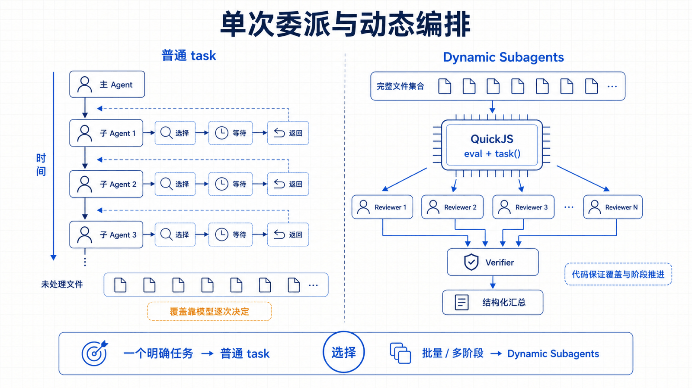
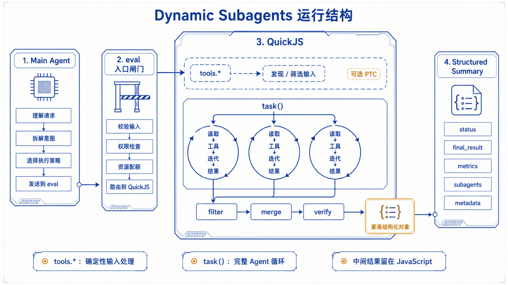
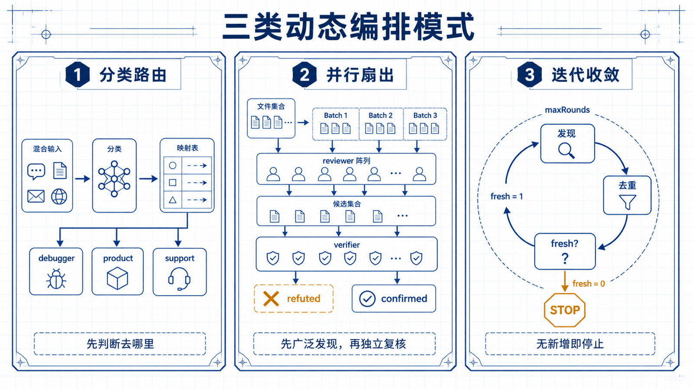
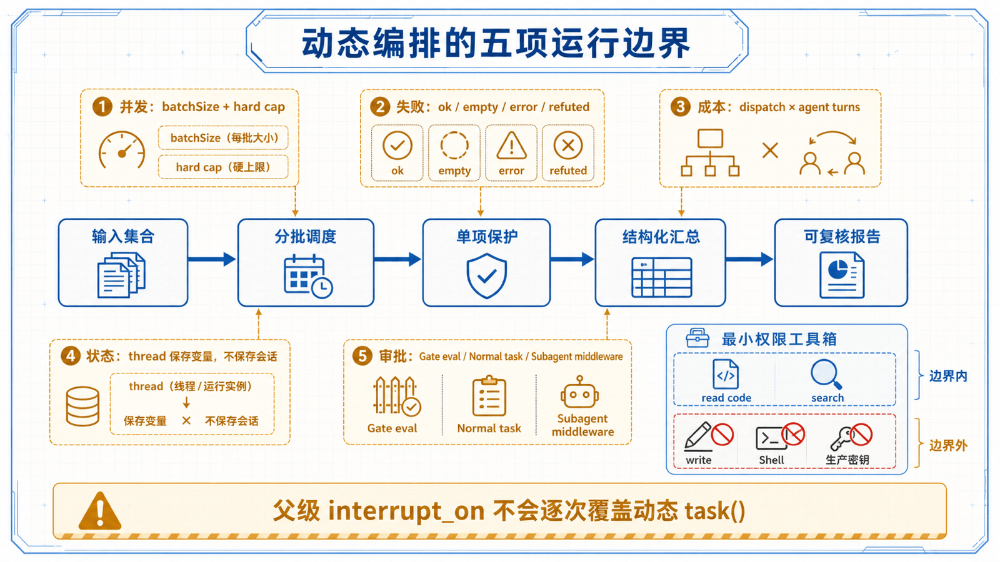

# 第 16 章：Dynamic Subagents — 用代码编排多个 Agent

> 一个代码仓库里有 24 个路由文件。主 Agent 可以把第一个文件交给代码审查 Agent，等结果回来，再决定是否检查第二个；也可以先列出全部文件，用 JavaScript 一次组织 24 次审查，再把可疑发现交给另一个 Agent 复核。两种方式都用了子 Agent，差别在于谁控制任务的拆分、并发和下一阶段。

直接调用子 Agent 适合一次明确委派。任务覆盖许多独立对象，或者需要分类、并行、交叉验证和反复收敛时，让模型逐次选择下一次委派会带来漏项、额外模型轮次和不稳定的控制流。Dynamic Subagents（动态子 Agent）沿用上一章的 QuickJS Interpreter：模型先生成编排代码，再由代码调用内置的 `task()`，启动多个完整的子 Agent 循环并汇总结果。

你会配置 `reviewer` 和 `verifier` 两个角色，理解 `task()` 与普通 `task` Tool 的差别，再运行“批量代码审查 + 交叉验证”实验。完成后，你应该能按任务形状选择分类路由、并行扇出或迭代收敛，并能为并发、失败、成本、状态和审批设置边界。

Dynamic Subagents 依赖仍处于 Beta 的 Interpreter Runtime，接口和生命周期可能继续变化。官方要求 Python 3.11+ 与 `langchain-quickjs>=0.2.0`；本章在 `deepagents==0.7.8`、`langchain-quickjs==0.3.5` 中核对接口和运行时限制。

## 1. 从单次委派到动态编排

Deep Agents 已经可以通过普通 `task` Tool 把工作交给子 Agent。主 Agent 每次决定一个 `description` 和一个 `subagent_type`，等待该子 Agent 完成，再继续自己的推理循环。

这种方式没有问题，只是控制粒度不同：

| 任务形状 | 优先方式 | 原因 |
|---|---|---|
| 把一个明确问题交给一个专家 | 普通 `task` Tool | 路径短，容易观察和逐次审批 |
| 对一批独立对象执行同类分析 | Dynamic Subagents | JavaScript 可以完整覆盖输入并并行扇出 |
| 输入混杂，需要先分类再分发 | Dynamic Subagents | 分类结果可以直接决定下一批 `subagentType` |
| 同一发现需要独立复核 | Dynamic Subagents | 第一阶段输出可以在代码中进入第二阶段 |
| 范围未知，需要反复搜索直到没有新结果 | Dynamic Subagents | 循环和停止条件由代码明确表达 |
| 子任务要在后台持续运行并由主 Agent 随后查询 | Async Subagents | 生命周期目标不同，不应混为并行扇出 |

Dynamic Subagents 不是新的子 Agent 类型。它改变的是编排位置：普通委派由主模型逐次调用 `task` Tool；动态编排则由一次 `eval` 中的 JavaScript 多次调用 `task()`。



### 为什么代码编排更稳定

假设要审查 24 个文件。模型逐次委派时，每次返回都可能改变后续决策；如果上下文变长，模型还可能提前总结，留下没有处理的文件。把文件列表放进 JavaScript 后，可以明确表达：

1. 每个输入都进入一次审查。
2. 独立任务按批次并行运行。
3. 第一阶段的发现统一去重和筛选。
4. 只有高风险发现进入复核。
5. 最终只把已确认的结果交还主模型。

代码保证的是控制流和覆盖范围，不是子 Agent 判断必然正确。每次 `task()` 都会启动完整的 Agent 推理循环，结果仍受模型、Prompt、工具和输入影响。

## 2. 配置 Subagents，并在 QuickJS 中使用 `task()`

在已有 Python 项目中安装 Deep Agents、QuickJS 中间件和模型集成：

```bash
uv add "deepagents[quickjs]" langchain-openai
```

本章沿用上一章的 OpenAI 兼容模型配置，不创建新的项目模板。先准备两个职责窄、判断方向相反的子 Agent：`reviewer` 负责提出候选问题，`verifier` 负责独立检查证据并反驳误报。

```python
from deepagents import create_deep_agent
from langchain_quickjs import CodeInterpreterMiddleware

subagents = [
    {
        "name": "reviewer",
        "description": "检查代码中的安全问题并给出文件、行号和证据",
        "system_prompt": "你是代码安全审查员。只报告有代码证据的问题。",
    },
    {
        "name": "verifier",
        "description": "独立复核候选安全问题，优先识别误报",
        "system_prompt": "你是审慎的复核员。重新读取代码后再确认或反驳。",
    },
]

agent = create_deep_agent(
    model=model,
    subagents=subagents,
    middleware=[CodeInterpreterMiddleware(mode="turn")],
)
```

`name` 是 `task()` 选择角色时使用的稳定标识；`description` 帮助主 Agent 判断角色用途；`system_prompt` 约束该角色的工作方法。真实应用还可以为每个子 Agent 单独配置模型、工具、中间件、权限和审批规则。

只要 Agent 同时拥有子 Agent 和 `CodeInterpreterMiddleware`，解释器就会在 JavaScript 顶层暴露 `task()`：

```typescript
const review = await task({
  description: "读取 src/auth/login.ts，检查认证绕过；引用行号。",
  subagentType: "reviewer",
  label: "审查 login.ts",
});
```

这里的 `task()` 不是一个只执行单次模型调用的函数。它会选择已配置的子 Agent，向它发送完整任务描述，让它自行使用获准工具、迭代并返回最终结果。

`description` 是本次调度交给子 Agent 的任务说明，应包含目标、范围、约束和输出要求。文件已经存在时，传路径和符号名，让子 Agent 自己读取；不要先把整份文件塞进字符串，再为每个子 Agent 复制一遍。`label` 只用于进度展示，不影响子 Agent 的推理。

一次调度结束后，调用方拿到的是结果，不是一个可以继续对话的子 Agent 会话。需要追加问题时，应发起新的 `task()`，并把必要上下文写进新的任务描述。

### “workflow” 是提示信号，不是 API 参数

官方 Interpreter Prompt 会把用户请求中的 “workflow” 视为动态编排信号。例如：

```python
result = agent.invoke({
    "messages": [{
        "role": "user",
        "content": "运行一个 workflow：审查 src/routes/ 下的文件，并复核高风险发现。",
    }]
})
```

它帮助模型倾向于用 `eval` 和 `task()` 组织批处理，但不是开启 Dynamic Subagents 的必填参数。能力是否存在仍取决于 `subagents` 和 `CodeInterpreterMiddleware` 配置；只有一次直接委派时，也不必刻意写成 workflow。



## 3. 三类编排模式：分类路由、并行扇出、迭代收敛

官方文档列出了分类处理、扇出汇总、对抗复核、生成筛选、锦标赛和循环直到完成等模式。它们不需要不同的中间件开关，可以折叠成三类控制结构：先决定去哪里、让独立工作同时发生、根据结果继续下一轮。

### 分类路由：先判断，再选择角色

一批输入需要不同专家时，先用轻量角色分类，再根据结果选择 `subagentType`。下面的核心片段把工单类别映射到三个角色：

```typescript
const specialist = {
  bug: "debugger",
  feature: "product-analyst",
  question: "support",
};

const handled = await Promise.all(tagged.map((ticket) =>
  task({
    description: `处理工单 ${ticket.id}，类别是 ${ticket.category}。`,
    subagentType: specialist[ticket.category],
  })
));
```

分类结果应限制在已配置角色集合中。不要直接把不受控制的模型文本当作 `subagentType`；先校验或用映射表收口，避免因为拼写漂移选择不存在的角色。

### 并行扇出与交叉验证：先广泛发现，再收紧结论

代码审查适合两阶段结构。第一阶段按文件扇出，第二阶段只复核候选发现：

```typescript
const reviews = await Promise.all(files.map((file) =>
  task({
    description: `审查 ${file}，只报告有行号和代码证据的问题。`,
    subagentType: "reviewer",
    responseSchema: findingsSchema,
  })
));

const findings = reviews.flatMap((item) => item.findings);
const verdicts = await Promise.all(findings.map((finding) =>
  task({
    description: `独立复核 ${finding.file}:${finding.line}：${finding.evidence}`,
    subagentType: "verifier",
    responseSchema: verdictSchema,
  })
));

const confirmed = findings.filter((_, index) => verdicts[index].confirmed);
```

第一阶段偏召回率，允许提出候选；第二阶段偏准确率，要求重新检查并主动反驳。两阶段使用不同角色和不同 Prompt，才是真正的交叉验证。让同一个输出原样自我确认，独立性很弱。

如果文件列表来自目录发现，可以像上一章一样显式启用 PTC：`tools.glob(...)` 负责找到输入，`task()` 负责需要推理的审查。PTC 默认关闭；Dynamic Subagents 则在已配置子 Agent 时默认对解释器开放。两条桥可以组合，但职责不同。

### 迭代收敛：把停止条件写进代码

当范围事先未知，可以让分析 Agent 分轮发现候选，对 ID 去重，直到本轮没有新增项：

```typescript
const seen = new Set();
const found = [];

for (let round = 0; round < 5; round += 1) {
  const result = await task({
    description: `继续寻找遗漏问题。已发现：${[...seen].join(", ") || "无"}`,
    subagentType: "reviewer",
    responseSchema: findingsSchema,
  });
  const fresh = result.findings.filter((item) => !seen.has(item.id));
  if (fresh.length === 0) break;
  for (const item of fresh) { seen.add(item.id); found.push(item); }
}
```

即使业务停止条件是“没有新结果”，仍应加最大轮数。没有硬上限的 Agent 循环会把偶发的新表述误当成新发现，持续消耗模型调用。

生成多个方案再筛选、让方案两两竞争的锦标赛，本质上也属于迭代收敛：并行产生候选，结构化评分，留下少量胜者，再进入下一轮。



## 4. 用 `responseSchema` 约束输出并完成汇总

自由文本适合直接展示，不适合驱动下一段代码。字段名变化、缺失数组或把数字写成文字，都会让筛选和排序变得脆弱。只要结果还要进入 JavaScript 的下一阶段，就给 `task()` 提供 JSON Schema。

下面的 Schema 只保留汇总真正需要的字段：

```typescript
const findingsSchema = {
  type: "object",
  properties: {
    findings: {
      type: "array",
      items: {
        type: "object",
        properties: {
          id: { type: "string" },
          file: { type: "string" },
          line: { type: "number" },
          severity: { type: "string", enum: ["high", "medium", "low"] },
          evidence: { type: "string" },
        },
        required: ["id", "file", "line", "severity", "evidence"],
      },
    },
  },
  required: ["findings"],
};
```

带 `responseSchema` 的结果已经是符合 Schema 的 JavaScript 值，可以直接读取 `result.findings`。不要再执行 `JSON.parse(result)`；只有子 Agent 被明确要求返回 JSON 字符串时，才需要解析字符串。

结构化输出解决的是组合契约，不等于事实正确。`severity: "high"` 仍然只是 reviewer 的判断，所以实验还要交给 verifier 复核证据。Schema 也应保持紧凑：字段越多，子 Agent 越难稳定填满，结果进入上下文时也越大。

### 汇总时保留证据链

合并结果时不要只留下结论。至少保留：

- 来源文件和行号，用于重新定位代码。
- reviewer 的证据摘要，用于解释候选从哪里来。
- verifier 的确认状态和理由，用于区分已确认与已反驳。
- 稳定 ID，用于跨批次去重和统计。

最后可以按严重级别排序、按 `file + line + id` 去重，再把已确认结果交给主 Agent 生成自然语言报告。排序、去重和计数属于确定性工作，留在 JavaScript；风险解释和修复建议需要语义判断，再由 Agent 完成。

## 5. 并发、失败、成本、状态与权限边界

Dynamic Subagents 把并发写成几行代码，也很容易在几行代码里放大调用量。上线前要同时约束五类边界。

### 并发：分批扇出，不要一次启动全部任务

本章验证版本的 Interpreter Prompt 建议把独立调度按约 10 个一批执行，运行时对同一个 REPL 线程还设置了 32 个并发子 Agent 调用的硬上限。业务配置应更保守：并发上限由模型 Provider 限流、子 Agent 工具容量、超时和预算共同决定。

```typescript
const batchSize = 8;
const reviews = [];
for (let i = 0; i < files.length; i += batchSize) {
  const batch = files.slice(i, i + batchSize);
  reviews.push(...await Promise.all(batch.map(reviewFile)));
}
```

这不是让八个 Agent 共享一个推理循环，而是同时启动八个彼此独立的完整循环。

### 失败：保留成功结果，并明确失败清单

`Promise.all` 中任一 Promise 抛错，整批等待会直接失败。批量任务应该在单项边界捕获异常，返回 `{ ok, item, value | error }` 这样的统一结构。汇总时分别统计成功、失败和待重试项；重试还要设置次数上限，并只对幂等任务启用自动重试。

不要把“返回空 findings”与“子 Agent 执行失败”合并成同一种结果。前者表示完成审查但没有发现，后者表示没有得到可用判断。

### 成本：`task()` 是完整 Agent 循环

总成本不只等于调度次数，还取决于每个子 Agent 内部的模型轮次、读取文件数量和工具调用。可以用一个简单预算估算：

```text
总模型工作量 ≈ 调度数 × 每个子 Agent 的平均推理轮次 + 主 Agent 汇总轮次
```

先用确定性工具发现和过滤输入，只把需要判断的对象交给子 Agent；先做便宜分类，再对少量高风险项深审；限制每轮输入数和迭代轮数。这些优化通常比单纯提高并发更有效。

### 状态：Interpreter 变量持久化，不等于子 Agent 会话持久化

`mode="thread"` 可以让 JavaScript 变量跨 Agent turn 恢复。它适合保留 `files`、`findings` 或去重集合，但不意味着上一次 `task()` 启动的子 Agent 还能继续接收消息。下一次调度仍是新的运行，任务描述必须自包含。

需要跨轮状态时复用同一个 `thread_id` 并配置 Checkpointer；只在当前请求内编排时，用 `mode="turn"` 可以减少旧变量干扰。

### 权限与审批：父 Agent 的 `interrupt_on` 不会逐次覆盖动态调度

`task()` 在已经开始的 `eval` 调用内部调度子 Agent，不经过父 Agent 普通 `task` Tool 的逐次调用路径。因此，父 Agent 为普通 `task` 配置的 `interrupt_on` 不会在每次动态调度前重复触发。

如果启动子 Agent 前必须人工确认，可以选择：

1. 对 `eval` 本身设置审批，把整批动态编排作为一次审批单元。
2. 使用普通 `task` Tool，让每次委派回到父级调用路径。
3. 在声明式子 Agent 自己的配置中加入审批中间件，保护它内部的高风险工具。
4. 设置 `CodeInterpreterMiddleware(subagents=False)`，禁止解释器内的动态调度，同时保留普通 `task` Tool。

每个子 Agent 只应获得完成角色任务所需的工具和文件权限。让 reviewer 读取代码，不代表它需要写文件、执行任意 Shell 或访问生产密钥。动态编排扩大的是调用规模，不应该顺带扩大能力范围。



## 6. 运行“批量代码审查 + 交叉验证”实验

选择一个包含 4 到 8 个源文件的小目录。为了让实验结果可复核，目录中最好同时包含：明显的输入校验、一个需要判断上下文的可疑点，以及几个没有问题的文件。

向 Agent 提交下面的任务：

```text
运行一个代码审查 workflow：
1. 找出目标目录中的源文件；
2. 使用 reviewer 分批审查每个文件；
3. 把所有候选问题交给 verifier 独立复核；
4. 只汇总已确认问题，同时列出失败和被反驳的数量。
```

模型生成的 JavaScript 和自然语言措辞不会完全一致。不要匹配整段答案，检查这些可观察行为：

1. 主 Agent 使用 `eval`，并在代码中调用 `task()`，而不是逐个调用普通 `task` Tool。
2. 所有目标文件都进入 reviewer，批次大小没有超过设定值。
3. reviewer 返回符合 `responseSchema` 的候选列表，代码没有再次 `JSON.parse`。
4. 每个候选发现都进入 verifier，已反驳项不会出现在最终确认列表。
5. 单个文件失败时，成功结果仍被保留，最终报告单独列出失败对象。
6. 最终结果包含文件、行号、证据和复核理由，可以回到源码检查。
7. Trace 或事件记录能区分主 Agent、`eval` 和各次子 Agent 调度，调用数量与预算一致。

代表性的汇总形状可以是：

```text title="代表性结果"
审查文件：6
候选问题：4
已确认：2
已反驳：2
执行失败：0
```

数字取决于你的代码和模型，不是固定答案。实验的重点是证明：输入覆盖、两阶段调度、结构化合并、失败隔离和审批边界都符合设计。

### 选型检查

在真实任务中启用 Dynamic Subagents 前，逐项回答：

- 输入是否可以组成明确的集合或批次？
- 每个子任务是否值得启动完整 Agent 循环？
- 任务更适合分类路由、并行扇出还是迭代收敛？
- 哪些中间结果必须用 `responseSchema` 约束？
- 单批并发、总调度数、重试和最大轮数分别是多少？
- 单项失败后是继续、重试还是终止整批？
- JavaScript 状态需要保留到 call、turn 还是 thread？
- 审批应发生在每次普通委派、整次 `eval`，还是子 Agent 内部工具？

如果任务只有一次明确委派，普通 `task` Tool 通常更清楚。如果任务没有可枚举的工作集，也没有可写成代码的路由或停止条件，不要为了“多 Agent”而引入动态编排。

## 本章小结

- Dynamic Subagents 使用 Interpreter 中的 JavaScript 编排已配置子 Agent。
- 普通 `task` Tool 适合单次委派；`task()` 适合批量路由、并行扇出和多阶段组合。
- 每次 `task()` 都运行一个完整的子 Agent 循环，成本和权限要按调度规模计算。
- `description` 应自包含，并优先传文件路径等定位信息，不复制大段文件内容。
- “workflow” 是帮助模型选择动态编排的提示信号，不是 API 开关。
- 分类路由、并行扇出与交叉验证、迭代收敛可以覆盖常见编排模式。
- `responseSchema` 让结果直接成为可组合的 JavaScript 值，不需要再次 `JSON.parse`。
- 并发应分批限制；单项失败、空结果和被反驳结果必须分开记录。
- `mode="thread"` 保存的是 Interpreter 变量，不会把一次子 Agent 调度变成可续聊会话。
- 动态 `task()` 不逐次执行父级普通 `interrupt_on`；需要逐次审批时使用普通 `task`，或关闭 `subagents` 动态桥。

## 官方参考

- [Deep Agents Dynamic Subagents](https://docs.langchain.com/oss/python/deepagents/dynamic-subagents)
- [Deep Agents Interpreters](https://docs.langchain.com/oss/python/deepagents/interpreters)
- [Deep Agents Subagents](https://docs.langchain.com/oss/python/deepagents/subagents)
- [Deep Agents Human-in-the-Loop](https://docs.langchain.com/oss/python/deepagents/human-in-the-loop)
- [Deep Agents Event Streaming](https://docs.langchain.com/oss/python/deepagents/streaming)
